<p align="center">
  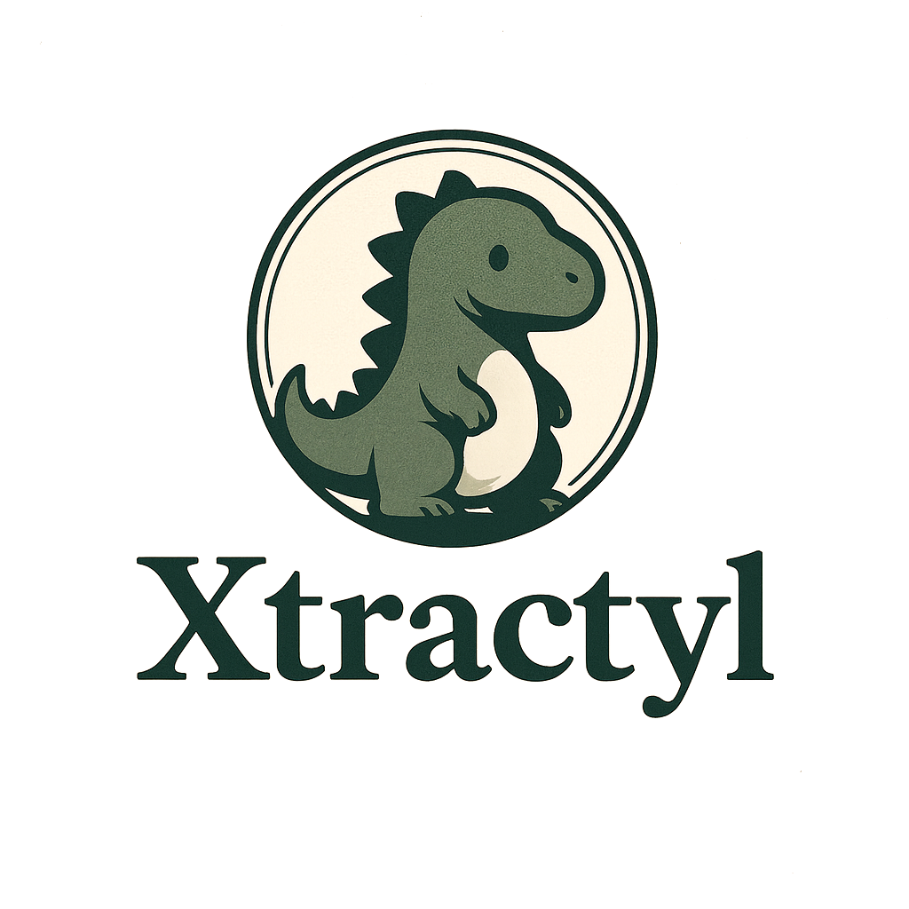
</p>

# 🦕 Extract structured data from messy medical PDFs

**Xtractyl** is a modular, local, human-in-the-loop AI pipeline that searches unstructured PDF documents for specific cases and builds a structured database from them.

It converts PDFs → HTML → DOM → pre-labels them with an LLM → enables manual review via Label Studio → and 🦕 **xtracts** structured data for downstream analysis.

Xtractyl provides evaluation and performance metrics for the LLM used, allowing comparison of speed–accuracy trade-offs across different models, question formulations, and system prompts.  
Planned: local fine-tuning of models on domain-specific data to further improve performance.

🔍 Designed for **privacy-first**, human-validated data extraction with built-in evaluation and comparison tools.

> **Status:** Core pipeline functional for simple PDFs. Hardening in progress — see [Current Status & Roadmap](#-current-status--roadmap).


---

## Why this matters
Xtractyl runs fully locally and does not rely on external APIs or cloud services.

Extracting structured data from unstructured documents is a major challenge in regulated, data-intensive industries such as healthcare, life sciences, and public administration.
Xtractyl is used to identify patterns and extract structured data to generate aggregated, group-level insights — helping researchers and developers build auditable, privacy-preserving data pipelines.

Xtractyl demonstrates how to design a privacy-first, human-in-the-loop AI pipeline that is modular, auditable, and extensible.
It aims to create structured databases from the content of unstructured PDFs, combining local AI processing with human validation and modern containerized architectures.

While not a medical device, Xtractyl addresses key challenges relevant to MedTech and other compliance-driven fields:
	•	🔒 Local, privacy-preserving data processing
	•	🤖 AI-assisted annotation with human validation
	•	🧩 Extensible pipeline architecture using Docker and modern ML tools

⚠️ Note: Xtractyl is a research-only tool — not intended for commercial or medical use.

⚠️ Note: All included medical test data are fully synthetic and created with AI.

⚠️ Note: For development purposes data currently shows up in the local log files (be aware of that when working with real data), this is currently being hardened, see below under "logging" for additional information.

⚠️ Note: Label Studio currently needs short time online connection to display projects: https://github.com/HumanSignal/label-studio/issues/9086#issuecomment-3817949828 
A solution is being worked on.


---


## 🎯 Why Xtractyl — Design Philosophy

Extracting structured data from unstructured medical documents is not primarily a technical problem — it is an evaluation problem.

Any model can produce outputs. The hard part is knowing whether those outputs are correct, understanding why they fail, and systematically improving performance while maintaining full data privacy.

Xtractyl is built around this insight. The pipeline follows a deliberate cycle:

1. **Build a ground truth** — human-validated annotations on a representative subset define what correct extraction looks like
2. **Optimize systematically** — system prompt, question formulation, and model selection are evaluated against the ground truth using precision, recall, F1, and latency metrics
3. **Scale to the full dataset** — the optimized configuration runs on the complete document collection with human-in-the-loop review
4. **Fine-tune a small model [not added yet]** — labeled data from the pipeline is used to train a domain-specific SLM, reducing inference cost and latency while maintaining accuracy
5. **Evaluate and iterate** — metrics and drift monitoring ensure that performance is maintained over time and across document types

This approach is designed for environments where data privacy is non-negotiable, ground truth matters, and black-box outputs are not acceptable — healthcare, life sciences, and other regulated domains.


---


## 🏗️ Architecture Overview

Items with green background are already implemented end-to-end ✅, items with red background are under construction 🧱

```mermaid
flowchart TD

%% ====== TOP NODE ======
T[Frontend]

%% ====== ROW 1 ======
subgraph ZA[" "]
direction LR
 A1A[Frontend - Upload & Convert Docs] --> B1A[Docling]
end

T --> ZA

%% ====== ROW 2 ======
subgraph ZA2[" "]
direction LR
 A2A[Frontend - Create Project] --> B2A[Orchestrator] --> C2A[Label Studio]
end

ZA --> ZA2

%% ====== ROW 3 ======
subgraph ZA3[" "]
direction LR
 A3A[Frontend - Upload Tasks] --> B3A[Orchestrator] --> C3A[Label Studio]
end

ZA2 --> ZA3

%% ====== ROW 4 ======
subgraph ZA4[" "]
direction LR
 A4A[Frontend - Start AI]
 B4A[Orchestrator]
 C4A[Redis] 
 D4A[Worker] 
 E4A[ML backend] 
 F4A[Ollama]
 G4A[Label Studio]
end

A4A --> B4A
B4A --> C4A
C4A --> D4A
D4A --> E4A
E4A --> F4A
F4A --> E4A
E4A --> G4A

ZA3 --> ZA4

%% ====== ROW 5 ======
subgraph ZA5[" "]
direction LR
 A5A[Frontend - Review AI] --> B5A[Label Studio]
end

ZA4 --> ZA5

%% ====== ROW 6 ======
subgraph ZA6[" "]
direction LR
 A6[Frontend - Get Results] --> B6A[Orchestrator] --> C6A[Label Studio]
end

ZA5 --> ZA6

%% ====== ROW 7 ======
subgraph ZA7[" "]
direction LR
 A7[Frontend - Evaluate AI] --> B7A[Orchestrator] --> C7A[Label Studio] 
end

ZA6 --> ZA7

%% ====== ROW 8 ======
subgraph ZA8[" "]
direction LR
 A8[Frontend - Evaluate Drift] --> B8A[Orchestrator] 
end

ZA7 --> ZA8

%% ====== ROW 9 ======
subgraph ZA9[" "]
direction LR
 A9[Frontend - Finetune AI] 
end

ZA8 --> ZA9


%% ====== STYLING ======
style ZA fill:#A7F3D0,stroke:#88a,stroke-width:1px;
style ZA2 fill:#A7F3D0,stroke:#88a,stroke-width:1px;
style ZA3 fill:#A7F3D0,stroke:#88a,stroke-width:1px;
style ZA4 fill:#A7F3D0,stroke:#88a,stroke-width:1px;
style ZA5 fill:#A7F3D0,stroke:#88a,stroke-width:1px;
style ZA6 fill:#A7F3D0,stroke:#88a,stroke-width:1px;
style ZA7 fill:#A7F3D0,stroke:#88a,stroke-width:1px;
style ZA8 fill:#A7F3D0,stroke:#88a,stroke-width:1px;
style ZA9 fill:#FCA5A5,stroke:#88a,stroke-width:1px;
  ```


---

## 🚀 Features

- 🔒 Keeps all your data local — no cloud processing
- 📄 Convert PDFs into structured HTML via Docling
- 🤖 AI-assisted pre-labeling with local LLMs (Ollama: tested with Gemma3 12B )
- 🧠 DOM-based XPath mapping and label matching
- 👩‍⚕️ Human validation with Label Studio
- 🦕 Extract structured databases from previously unstructured data
- 🔍 Identify specific cases across large document collections
- 📊 Built-in evaluation of AI predictions (precision, recall, F1, accuracy)
- ⏱️ Performance metrics (end-to-end runtime, per-document and per-question latency)
- ⚖️ Speed–accuracy comparison across models, prompts, and question formulations
- 🐳 Modular, containerized Docker architecture

---

## 📅 Planned Features

- 🦕 Create dashboards from your Xtractyl-generated database  
- 🎛️ Fine-tune models based on your labeled data 
- 🧠 Bootstrapping: Train SLM based from LLM generated and HITL reviewed data


---

## 🗺️ Current Status & Roadmap

### Phase 1 – Proof of Concept (completed)

The core pipeline is functional end-to-end: PDF ingestion, HTML conversion via Docling, DOM extraction, LLM-based pre-labelling via Ollama, human review in Label Studio, and structured export of results and evaluation metrics.

Current limitation: the pipeline has been validated on structurally simple PDFs. Complex layouts (multi-column, nested tables, non-standard formatting) are not yet reliably handled. Improving extraction quality is intentionally deferred — optimizing on top of an unstable foundation would be premature.

### Phase 2 – Hardening (in progress)

The focus is on building a consistent engineering foundation before scaling features. The orchestrator serves as the template; patterns established there will be replicated across all containers. The orchestrator is the central integration point of the pipeline and therefore the highest-leverage starting point. Hardening it first ensures that architectural decisions are validated before being replicated across the remaining containers.

**Orchestrator (template, in progress)**
- Layered architecture: `app.py` → `routes` → `contracts` → `domain` → `services` → `clients`
- Centralized error handling with typed domain errors
- Pydantic-based API contracts with OpenAPI documentation (`/apidoc`) — see `/results` and `/evaluation` endpoints as reference
- Structured logging with safe/dev modes (no sensitive data in default mode)
- Fixture logging for synthetic test data
- Unit tests with CI integration

**All remaining containers (planned, sequential)**

The same pattern will be applied to `ml_backend`, `worker`, and `docling`:
- Layered architecture mirroring the orchestrator
- Structured logging
- Fixture generation and unit tests integrated into CI
- Integration tests
- API contracts and OpenAPI documentation
- Centralized error handling

---

## 🧠 Finetuning Architecture (Planned)

The finetuning pipeline closes the improvement cycle that Xtractyl is designed around. Once a ground truth has been established and validated through human-in-the-loop review, the labeled data can be used to train a domain-specific small language model (SLM) — reducing inference cost and latency while maintaining or improving accuracy on the target document type.

### Pipeline: Label Studio → Finetuned SLM

**1. Dataset export and conversion**
Label Studio annotations are exported as JSON and converted into an instruction-tuning format suitable for SLM training. This conversion is handled by a dedicated service within the Xtractyl architecture, ensuring that only reviewed and submitted annotations are used as training data.

**2. Train/test split**
The converted dataset is split into training and validation sets using HuggingFace Datasets (`train_test_split`), allowing overfitting to be detected during training.

**3. Training**
Training is performed using [Unsloth](https://github.com/unslothai/unsloth) with LoRA/QLoRA via the HuggingFace Trainer — optimized for memory efficiency and speed on local hardware. No cloud infrastructure required.

**4. Metrics and live monitoring**
Training metrics (loss, validation loss, learning rate) are logged via TensorBoard and visualized locally — consistent with Xtractyl's privacy-first, fully local architecture.

**5. Evaluation**
After training, the finetuned model is evaluated against the ground truth using the same metrics as the base model (precision, recall, F1, accuracy, latency) — enabling direct comparison and informed model selection.

### Design principles
- Fully local — no data leaves the system at any point
- Ground truth controlled — only human-validated annotations enter the training pipeline
- Comparable — finetuned models are evaluated with the same framework as base models
- Integrated — finetuning is triggered and monitored through the Xtractyl frontend, not a separate tool

--

## Project Management & Collaboration
This project is managed using industry-standard tools:

- [Jira Board (private, invitation only – link available on request)]
- [Miro Board (private, invitation only – link available on request)]

---

## ⚙️ Setup

### 1. Requirements
Before installing Xtractyl, ensure you have the following installed on your system

- **GIT** 
- **Docker** 

### 2. Installation
Clone the repository:
git clone https://github.com/Xtractyl/xtractyl.git

Create a file named .env in the xtractyl folder (the .env.example file in /xtractyl is a template)

Create a file named .env in root/frontend/src (the .env.example file in xtractyl/frontend/src is a template)

For testing you can simply rename the .env.example files to .env (this will use default passwords and ports)

⚠️ **Warning:** The build currently downloads *all* Docling models (several GB) to ensure full offline functionality. This can be changed to the specific use case via modification of the file docker/docling/Dockerfile at the line: RUN docling-tools models download --all -o /opt/docling-models.

 Then start the Docker containers from the xtractyl folder with:
docker compose up --build

Access the frontend via your browser at http://localhost:5173/ following the workflow shown below under Usage

---

## 📘 API Documentation (OpenAPI / Swagger)

Automatically generated OpenAPI documentation using `flask-pydantic-spec` is currently being added. Currently available starting with the orchestrator.

When the containers are running, the documentation is available at:

http://localhost:5001/apidoc/swagger for the orchestrator

Each backend container exposes its own OpenAPI documentation on its respective port.

### How it works

- OpenAPI schemas are generated from Pydantic request and error contracts.
- Only endpoints using `@spec.validate(...)` are included in the documentation.
- Legacy endpoints remain undocumented until refactored.

To document a new endpoint:

1. Add `@spec.validate(...)`
2. Provide a Pydantic request model
3. Provide response status codes mapped to `ErrorResponse`
4. Restart the container

The endpoint will automatically appear in Swagger.

### 3. Testing

#### Smoke tests (pytest)

Included:
- orchestrator
- frontend
- ml_backend
- labelstudio 
- postgres (indirectly via labelstudio which depends on it)
- job_queue
- ollama

Explicitly not included
	- docling (excluded because smoke tests are integrated in CI and docling models are too large for that)

Not included because it runs forever
	- worker (endless loop; no health endpoint; would require a special “smoke mode”)

```bash
make deps
make up
make smoke
make down
```

#### Unit tests (pytest)
Currently in implementation.  Starting with the orchestrator

```bash
make deps
make unit-orchestrator
```

#### Integration tests (pytest)
Currently in implementation.

#### E2E tests
Planned next.

---


## 📖 Usage

1. **Open the frontend**  
	Go to: [http://localhost:5173]

2. **Upload your docs** (PDF → HTML conversion)  

   Page: **Upload & Convert Docs** (`/`)  
   - type a folder name  for your project
   - Select PDFs and click **Upload & Convert**  
   - You can monitor status and cancel a running job

---
### Upload Page
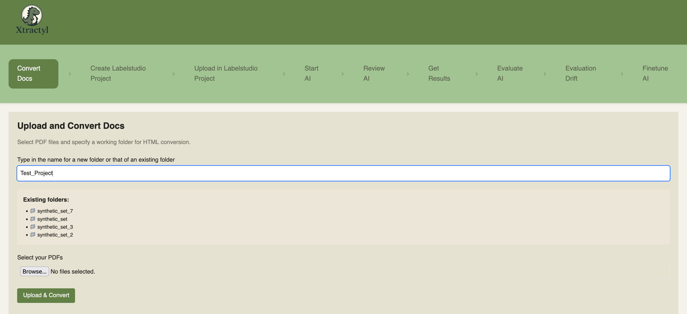

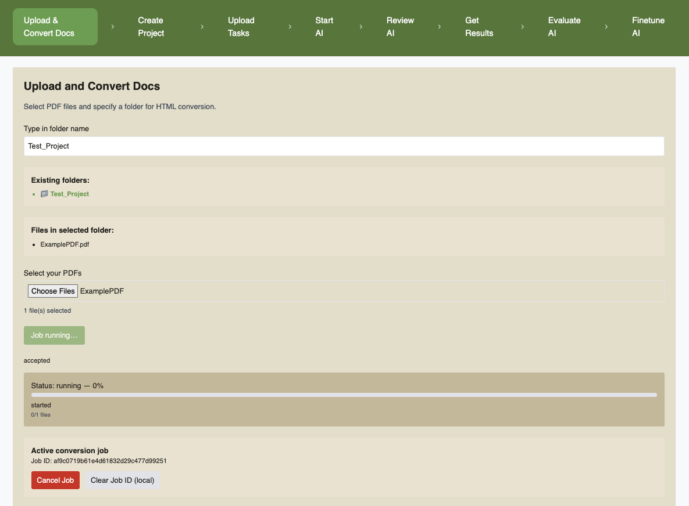

---

3. **Create a new project** in Label Studio  

   Page: **Create Project** (`/project`)  
   - Save your Label Studio token:
      click on "Get your legacy token" and create a user account for label studio
      in label studio go to http://localhost:8080/organization and enable the legacy token via the API Tokens setting go on http://localhost:8080/user/account then and copy the legacy token to your xtractyl tab and click "Save Token"
   - Enter project name, questions (one per line), and labels for each question (one per line
      and in the same order as the questions)
   - Create the project via the "Create project" button

---
### Create Project Page
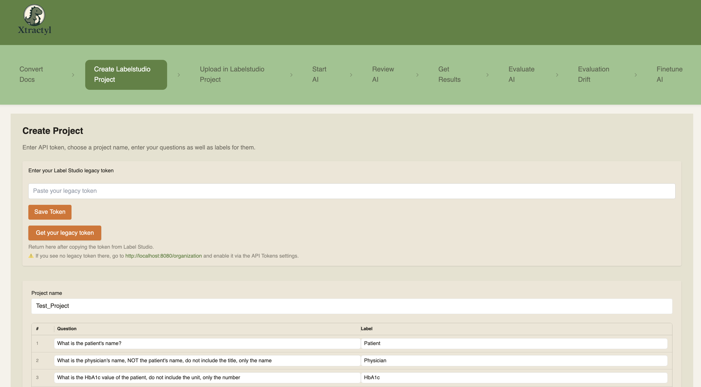

---

4. **Upload your tasks into the project**  

   Page: **Upload Tasks** (`/tasks`)  
   - Pick the project name  (same name as in step 3)
   - Select the HTML folder (from step 2)  
   - Click "Upload HTML Tasks"

---

### Upload Tasks Page
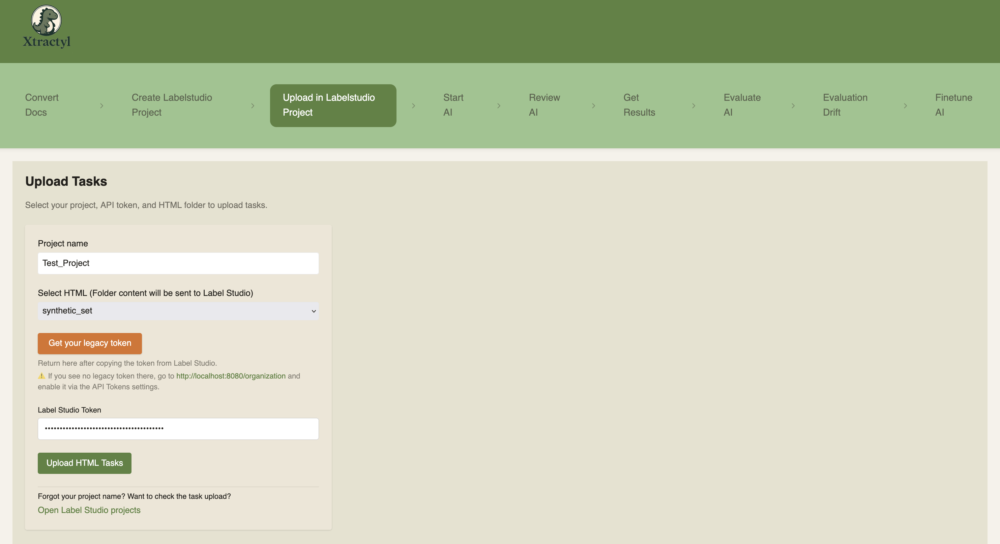

---

5. **Start AI prelabeling**  

   Page: **Start AI** (`/prelabelling`)  
   - Download an LLM (using the official model names from the linked ollama page)
   - After downloading a new model reload the page to make it available
   - Pick the project name  (same name as in step 3)
   - Enter the label studio token
   - Select a model from the dropdown list
   - Enter a system prompt to advise the model for literal extraction (you see a suggestions
      under "Show example")
   - Select the json file with your questions and labels from the dropdown list (click the
      the Preview button for review)
   - Click the "Start prelabeling button"

---
### Start AI Page
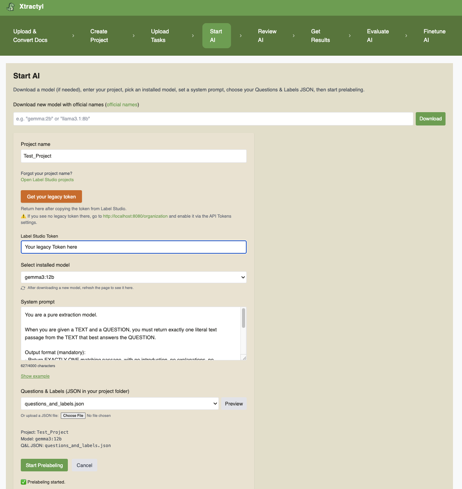

---

6. **Review the AI** 

   Page: **Review AI** (`/review`)  
   - Click the "Open Label Studio" to go to a to an overview of your label studio projects
   - Click on your project and
   - Validate/correct predictions for your files (in case you did not wait till prelabelling was finished, you have to reload to see the predictions added over time) and submit the changes

---

### Review AI 
❗❗THE FOLLOWING IMAGE SHOWS SYNTHETIC DATA ONLY AND IS AN EXAMPLE FOR RESEARCH USE❗❗
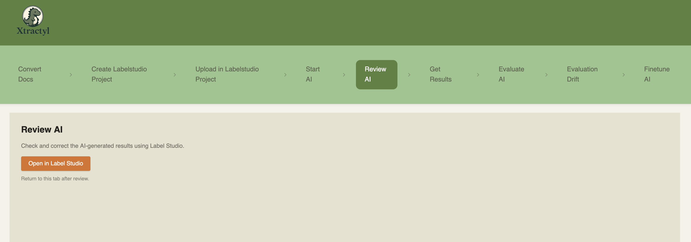
❗❗THE FOLLOWING IMAGE SHOWS SYNTHETIC DATA ONLY AND IS AN EXAMPLE FOR RESEARCH USE❗❗
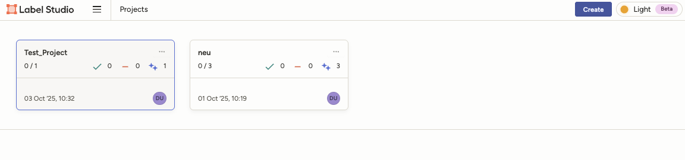
❗❗THE FOLLOWING IMAGE SHOWS SYNTHETIC DATA ONLY AND IS AN EXAMPLE FOR RESEARCH USE❗❗
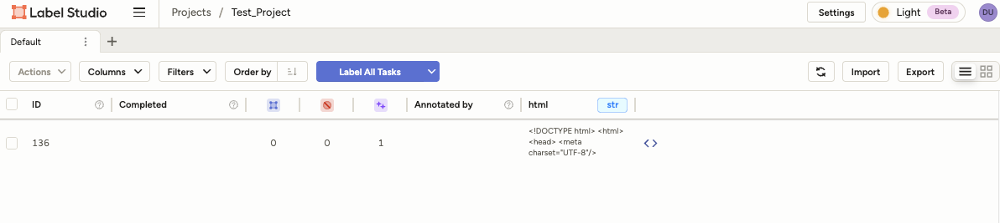
❗❗THE FOLLOWING IMAGE SHOWS SYNTHETIC DATA ONLY AND IS AN EXAMPLE FOR RESEARCH USE❗❗
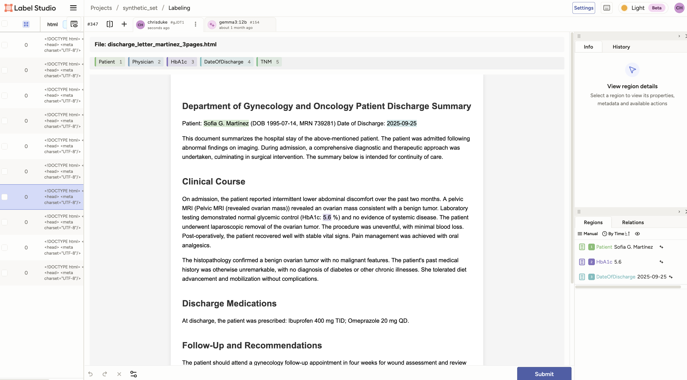
❗❗THE ABOVE IMAGE SHOWS SYNTHETIC DATA ONLY AND IS AN EXAMPLE FOR RESEARCH USE❗❗
---

7. **Results Page** 

   Page: **Get Results** (`/results`)  
   - Enter your project name 
   - Enter the label studio token
   - Click "Submit & Save as CSV" to get the results (in case you did not wait till prelabelling was finished, you have to re-click to see the predictions added over time)

---
### Get Results 
❗❗THE FOLLOWING IMAGE SHOWS SYNTHETIC DATA ONLY AND IS AN EXAMPLE FOR RESEARCH USE❗❗

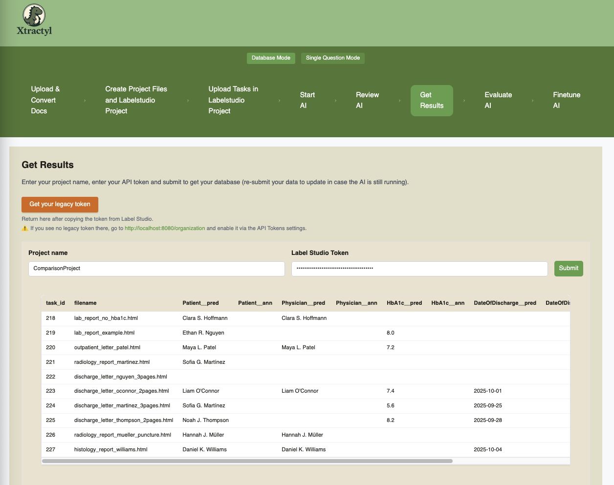

❗❗THE ABOVE IMAGE SHOWS SYNTHETIC DATA ONLY AND IS AN EXAMPLE FOR RESEARCH USE❗❗

---

8. **Evaluate the AI** (`/evaluate`)  
   - Enter the label studio token
   - Select a project with your groundtruth information
   - Select a project to compare against the groundtruth 
   - Click "Run Evaluation and Save as JSON"
   - Get metrics (Precision, Recall, F1, Accuracy) on an overall basis and per question/label
   - Get a per task (per PDF document) overview with groundtruth answer, predicted answer and raw LLM answer
   - Get performance metrics (time per task [per PDF document], LLM time per tasks, time per question, LLM time per question etc.)

---
### Evaluate the AI 
❗❗THE FOLLOWING IMAGE SHOWS SYNTHETIC DATA ONLY AND IS AN EXAMPLE FOR RESEARCH USE❗❗

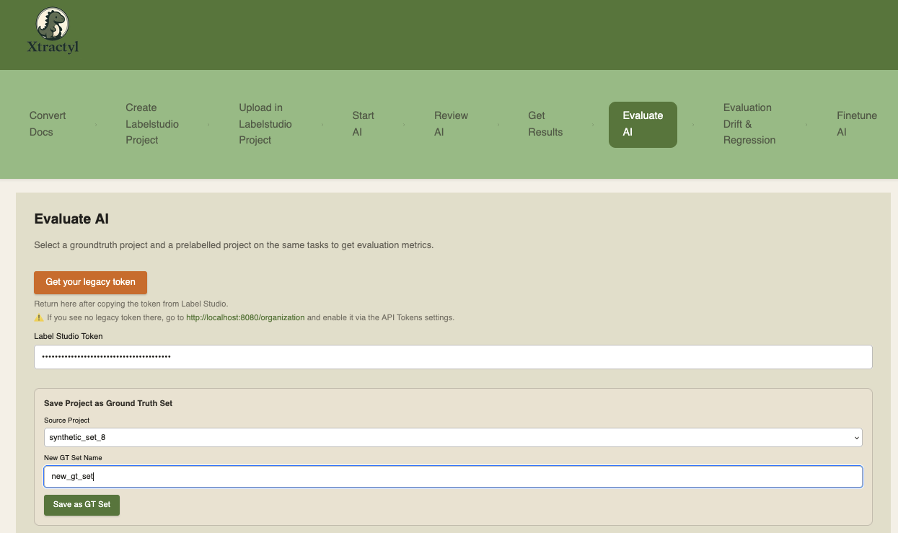

❗❗THE FOLLOWING IMAGE SHOWS SYNTHETIC DATA ONLY AND IS AN EXAMPLE FOR RESEARCH USE❗❗

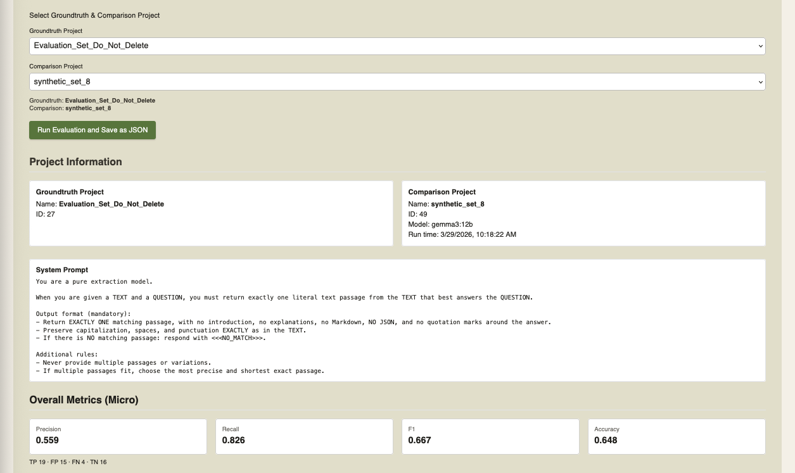

❗❗THE FOLLOWING IMAGE SHOWS SYNTHETIC DATA ONLY AND IS AN EXAMPLE FOR RESEARCH USE❗❗

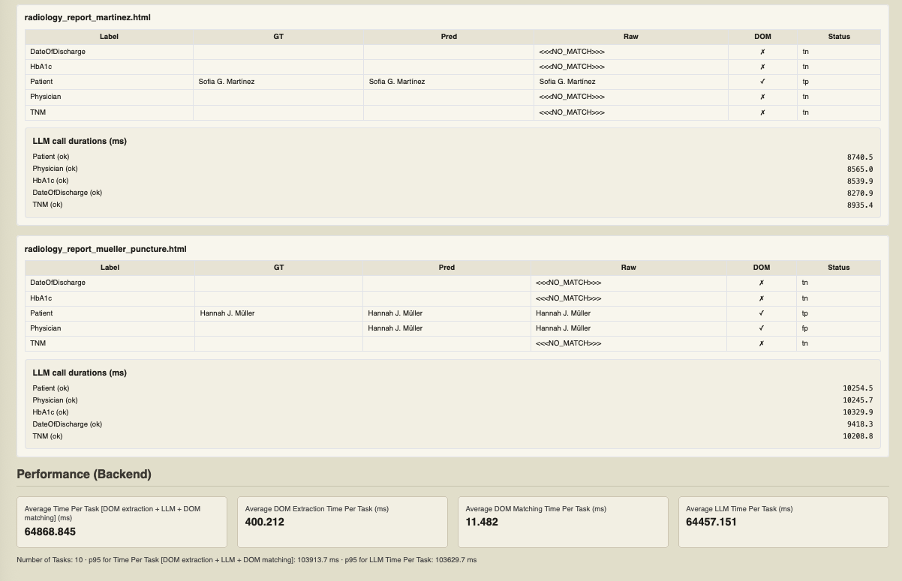

❗❗THE ABOVE IMAGES SHOW SYNTHETIC DATA ONLY AND IS AN EXAMPLE FOR RESEARCH USE❗❗

--- 

9. **Monitor Evaluation Drift/Regression over Time for a Standard Set** (`/evaluationdrift`)  

### Evaluation Drift 
❗❗THE FOLLOWING IMAGE SHOWS SYNTHETIC DATA ONLY AND IS AN EXAMPLE FOR RESEARCH USE❗❗

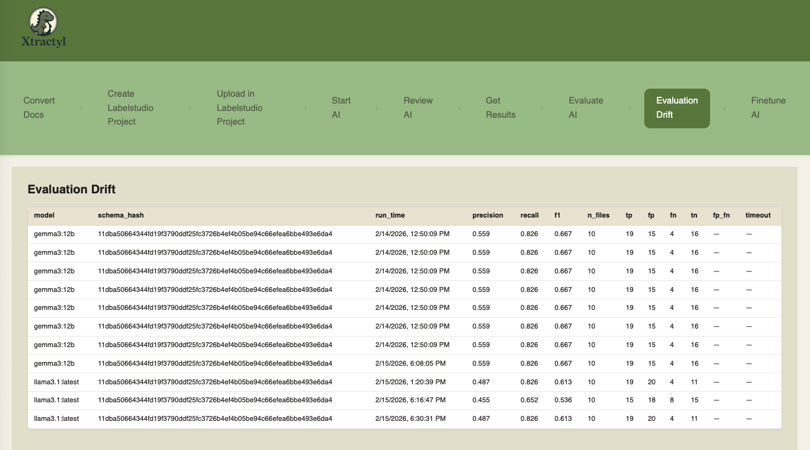

❗❗THE ABOVE IMAGES SHOW SYNTHETIC DATA ONLY AND IS AN EXAMPLE FOR RESEARCH USE❗❗

--- 

### ⏭️ Coming Soon

10. **Fine-tune the AI** (`/finetune`) 
   - Use your labeled data to improve model performance

---

## 🧹 Code quality (integrated into CI)

### python from repository root
```bash
ruff format .
ruff check .
ruff check . --fix
```
### js for frontend from frontend folder
```bash
cd frontend
npx eslint .
```
### Tests (see also "3. Testing" above for tests integrated into CI)

## Smoke tests
```bash
make deps
make up
make smoke
make down
```

## Unit tests 
```bash
make deps
make unit-orchestrator
```
---

## Versioning (SemVer)

This project uses Semantic Versioning (SemVer) with the format:

MAJOR.MINOR.PATCH

The version is stored in the root file `VERSION`.

Rules:

- PATCH: Bug fixes or internal changes that do not affect external behavior.
  Example: logging fixes, internal refactoring, test fixes.

- MINOR: Backward-compatible functional changes.
  Example: new features, new endpoints, extended functionality.

- MAJOR: breaking changes only after 1.0.0 (stable API).

  Example: API contract changes, data format changes, removal of functionality.

Note: While the major version is 0 (0.y.z), breaking changes may occur and are communicated via MINOR version bumps.

Version bump policy:

- Any change outside of `README.md` or `assets/` requires a version bump.
- The version bump must be included in the same Pull Request as the change.
- Git tags and GitHub releases are created automatically from the VERSION file.

Example:

VERSION
0.6.0 → 0.7.0

---

## 📜 logging (hardening in progress)

1) Default mode (safe logs)
	•	enabled by default
	•	logs exclude sensitive data
	•	logs are written to:
	•	stdout / stream
	•	logs/ directory
 	•	logs/evaluation_over_time.jsonl contains drift/regression monitoring for a standard set

2) Dev mode (debug artifacts)
	•	enabled only when explicitly requested
	•	logs may include sensitive data
	•	debug logs are written only to:
	•	data/logs/... (alongside evaluation / result artifacts)
	•	debug logs are never written to stdout or logs/

```bash 
DEBUG_ARTIFACTS=1 docker compose up
```

3) Fixture mode 
Saving data as files during a run for later use as test fixtures. Only with synthetic data in a pure dev environment. Endpoints are triggered via the GUI.
	•	Enabled only when explicitly requested (via env flags).
	•	Debug/fixture artifacts are written only to:
	•	data/fixtures/... (mounted fixture folder)
	•	After the run, fixtures must be copied manually from data/fixtures/ to tests/fixtures/.
	•	This is intentionally not automated to avoid inadvertent inclusion of sensitive data.
	•	When copying, keep the filename identical but append __SYNTHETIC_DATA (before .json; TWO underscores), e.g.
build_results_table_minimal__tasks_page__SYNTHETIC_DATA.json


```bash 
DEBUG_ARTIFACTS=1 CAPTURE_FIXTURES=1 SYNTHETIC_DATA=1 docker compose up
```

---

## 📝 Additional Documentation
For more details on how to use Label Studio (e.g. reviewing annotations, submitting, filtering), visit:
👉 https://labelstud.io/guide

---

## 📜 License

Xtractyl is licensed under the **Xtractyl Non-Commercial License v1.1**.  
You are free to use, copy, modify, and distribute this software **only for non-commercial purposes**.  
Any commercial use requires a separate commercial license from the copyright holders.

🔒 **No Commercial Use Allowed Without Permission**  
See the [LICENSE](LICENSE) file for full terms.

---

## 📝 Disclaimer / Licensing & Attribution


This project is a private, non-commercial initiative developed independently during personal time.  
It has no connection to any employer or professional affiliation and is provided as-is for research and experimentation.

This project is released under the **Xtractyl Non-Commercial License v1.1**.  
It incorporates the following open-source components:

- [Label Studio](https://github.com/heartexlabs/label-studio) — Apache-2.0 License  
- [Docling](https://github.com/docling/docling) — MIT License  
- [Ollama](https://github.com/ollama/ollama) — MIT License  
- Local LLMs such as Gemma, which are subject to their own license terms from the respective model providers (e.g., Google)

Please refer to the [LICENSE](LICENSE) file for the full license text.