<p align="center">
  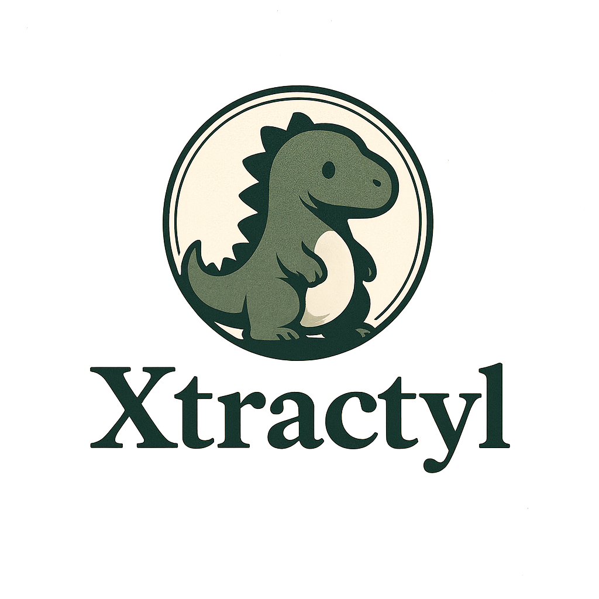
</p>


# Evaluate (and soon host) models for LLM-based literal data extraction


[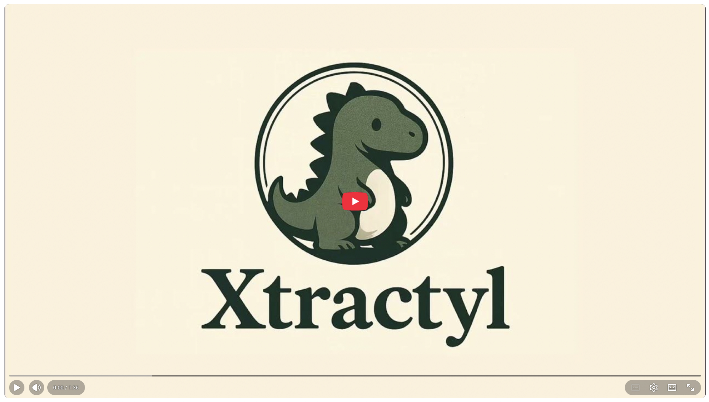](https://www.youtube.com/watch?v=ZyQJqWzFoLg)

**Xtractyl** is a modular, local, human-in-the-loop framework for evaluating LLM-based extractive question answering (answering questions with exact text passages from the input). It helps you find the right model, system prompt, and question formulation before serving that exact configuration in production.


It converts input documents → HTML/DOM → pre-labels them with an LLM → enables manual review via Label Studio → and evaluates the result against a human-validated ground truth (precision, recall, F1, latency). Once a configuration is validated, the next step (coming soon) is to promote it to a locked, monitored extraction endpoint.


Designed for **privacy-first**, human-validated evaluation, with built-in comparison across models, prompts, and question formulations.


> **Status:** Core pipeline functional. Active development — see [Current Status & Roadmap](#️-current-status--roadmap). See [Known Limitations](#️-known-limitations) for current constraints.

---

## Why this matters
Xtractyl runs fully locally and does not rely on external APIs or cloud services.

Getting an LLM to extract answers from an input document is not the hard part, any model can produce some answer. The hard part is knowing whether that answer is correct and the model can be trusted (not only with its answers, but also when it says that the text does not include the answer). The extraction has to be compared across models/prompts/questions, and the model has to be re-evaluated to detect potential drift (e.g. due to changes in the distribution of your data). That's the evaluation problem Xtractyl is built around.


This matters most in regulated, data-intensive industries such as healthcare, life sciences, and public administration, where ground truth matters, black-box outputs aren't acceptable, and neither is a model whose performance is unknown.

>**Note:** Xtractyl is a research-only tool, not intended for clinical or  commercial use. All included test data is fully synthetic. See [Current Status & Roadmap](#-current-status--roadmap) for current constraints.

## Regulatory & Quality Documentation

Xtractyl is developed with software quality and regulatory transparency 
in mind. A Design History File (DHF) structured according to the principles 
of IEC 62304 and ISO 14971 is maintained in a separate private repository.

This documentation is intended to support organizations that wish to build 
regulated AI systems on top of Xtractyl — for example under MDR or the 
EU AI Act — by providing auditable documentation of the training 
infrastructure.

> The existence of this documentation does not imply that Xtractyl 
> is a certified medical device or MDR-compliant product. Xtractyl 
> remains a research-only tool. Organizations building regulated systems 
> on top of Xtractyl are solely responsible for their own regulatory 
> assessment and certification.

---


## Why Xtractyl — Design Philosophy

Extracting answers from unstructured (medical) documents is not primarily a technical problem — it is an evaluation problem.

Any model can produce outputs. The hard part is knowing whether those outputs are correct, understanding why they fail, and systematically improving performance while maintaining full data privacy.

Xtractyl is built around this insight. The pipeline follows a deliberate cycle:

1. **Build a ground truth** — human-validated annotations on a representative subset define what correct extraction looks like
     for cases with no unique correct answer within the input document: review and correct a specific run's own raw LLM predictions within Label Studio (accept correct extractions when they answer the question to a sufficient degree, fix only the incorrect ones). This ground truth is anchored to that run's predictions and therefore slightly skewed; it cannot be reused to evaluate other runs, since there is no single correct answer and reruns don't need to be worded identically to be correct. But it allows for evaluating model for tasks that can be answered correctly using different passages.
2. **Optimize systematically** — system prompt, question formulation, and model selection are evaluated against the ground truth using precision, recall, F1, and latency metrics
3. **Scale to the full dataset** — the optimized configuration runs on the complete document collection with human-in-the-loop review to evaluate performance on a broader data set
4. **Host and monitor [not added yet]** — a validated configuration (model, system prompt, questions/labels, exact model hash) is promoted to a locked, versioned extraction endpoint with its validation results attached for provenance; automated reruns track drift over time and can withdraw a version if metrics fall below the established baseline
5. **Evaluate and iterate** — metrics and drift monitoring ensure that performance is maintained over time and across document types (can currently be done manually but will be automated in future)

This approach is designed for environments where data privacy is non-negotiable, ground truth matters, and black-box outputs are not acceptable — healthcare, life sciences, and other regulated domains.


---


## Architecture Overview


```mermaid
flowchart TD

%% ====== TOP NODE ======
T[Frontend]

%% ====== ROW 1 ======
subgraph ZA[" "]
direction LR
A1A[Frontend - Upload & Convert Docs] --> B1A[Orchestrator - prepare] --> C1A[MinIO]
A1A --> C1A[MinIO]
A1A --> B1B[Orchestrator - convert trigger] --> D1A[Job Queue] --> E1A[Worker Conversion] --> F1A[Docling]
end

T --> ZA

%% ====== ROW 2 ======
subgraph ZA2[" "]
direction LR
 A2A[Frontend - Create Project] --> B2A[Orchestrator] --> C2A[Label Studio]
end

ZA --> ZA2

%% ====== ROW 3 ======
subgraph ZA3[" "]
direction LR
 A3A[Frontend - Upload Tasks] --> B3A[Orchestrator] --> C3A[Label Studio]
end

ZA2 --> ZA3

%% ====== ROW 4 ======
subgraph ZA4[" "]
direction LR
 A4A[Frontend - Start AI]
 B4A[Orchestrator]
 C4A[Job Queue] 
 D4A[Worker] 
 E4A[ML backend] 
 F4A[Ollama]
 G4A[Label Studio]
end

A4A --> B4A
B4A --> C4A
C4A --> D4A
D4A --> E4A
E4A --> F4A
F4A --> E4A
E4A --> G4A

ZA3 --> ZA4

%% ====== ROW 5 ======
subgraph ZA5[" "]
direction LR
 A5A[Frontend - Review AI] --> B5A[Label Studio]
end

ZA4 --> ZA5

%% ====== ROW 6 ======
subgraph ZA6[" "]
direction LR
 A6[Frontend - Get Results] --> B6A[Orchestrator] --> C6A[Label Studio]
end

ZA5 --> ZA6

%% ====== ROW 7 ======
subgraph ZA7[" "]
direction LR
 A7[Frontend - Evaluate AI] --> B7A[Orchestrator] --> C7A[Label Studio] 
end

ZA6 --> ZA7

%% ====== ROW 8 ======
subgraph ZA8[" "]
direction LR
 A8[Frontend - Evaluate Comparison/Regression/Drift] --> B8A[Orchestrator] 
end

ZA7 --> ZA8


%% ====== STYLING ======
style ZA fill:#A7F3D0,stroke:#88a,stroke-width:1px;
style ZA2 fill:#A7F3D0,stroke:#88a,stroke-width:1px;
style ZA3 fill:#A7F3D0,stroke:#88a,stroke-width:1px;
style ZA4 fill:#A7F3D0,stroke:#88a,stroke-width:1px;
style ZA5 fill:#A7F3D0,stroke:#88a,stroke-width:1px;
style ZA6 fill:#A7F3D0,stroke:#88a,stroke-width:1px;
style ZA7 fill:#A7F3D0,stroke:#88a,stroke-width:1px;
style ZA8 fill:#A7F3D0,stroke:#88a,stroke-width:1px;
  ```

 **Note:** File upload bypasses the Orchestrator by design — PDFs go 
 directly from the frontend to MinIO via presigned URLs, keeping large 
 binary transfers off the API server. Conversion itself is still fully 
 pipeline-aware: the Orchestrator creates the job record and presigned 
 URLs, triggers the actual conversion via the job queue, and Worker 
 Conversion (not the frontend) calls Docling and writes results back to MinIO.

---

## Features

- Keeps all your data local — no cloud processing
- Convert PDFs into structured HTML via Docling
- AI-assisted pre-labeling with local LLMs (Ollama: tested with Gemma3 12B )
- DOM-based XPath mapping and label matching
- Human validation with Label Studio
- Extract structured databases from previously unstructured data
- Built-in evaluation of AI predictions (precision, recall, F1, accuracy)
- Performance metrics (end-to-end runtime, per-document and per-question latency)
- Speed–accuracy comparison across models, prompts, and question formulations
- Modular, containerized Docker architecture

---

## Planned Features
- Broaden scope from pure PDF ingestion to FHIR ingestion
- Host validated model configurations as an external extraction API, with automated reruns and rollback on metric drift


---

## Current Status & Roadmap

### Phase 1 – Proof of Concept (completed)

The core pipeline is functional end-to-end: PDF ingestion, HTML conversion via Docling, DOM extraction, LLM-based pre-labelling via Ollama, human review in Label Studio, and structured export of results and evaluation metrics.

Current limitation: the pipeline has been validated on structurally simple PDFs. Complex layouts (multi-column, nested tables, non-standard formatting) are not yet reliably handled. Improving extraction quality is intentionally deferred — optimizing on top of an unstable foundation would be premature.

### Phase 2 – Hardening (in progress)

The focus is on building a consistent engineering foundation before scaling features. The orchestrator serves as the template; patterns established there will be replicated across all containers. The orchestrator is the central integration point of the pipeline and therefore the highest-leverage starting point. Hardening it first ensures that architectural decisions are validated before being replicated across the remaining containers. This phase will also include expansion of unit tests, addition of integration and E2E tests as well as Frontend TypeScript migration.

### Phase 3 – FHIR integration (starting)

While currently the pipeline supports only PDF data, in future it will be possible to import FHIR data and evaluate a model on FHIR-input extraction-based-question-answering as well. So far a FHIR container and a FHIR seed container have been added to generate synthetic FHIR data for testing. The workflow to ingest the FHIR data will be added soon, the overall workflow already established for PDFs will be adapted to serve this data likewise.

- **Local FHIR test server** (`fhir`, `fhir_seed` in `docker-compose.yml`) — generates synthetic FHIR bundles for developing and testing a planned FHIR narrative/free-text ingestion adapter, not yet wired into the pipeline. See `docs/fhir-test-server.md`.

### Phase 4 – Model Hosting (planned)

Once a configuration is validated, promote it to a locked, versioned extraction endpoint with its validation results attached, and re-evaluate it on a recurring basis to catch drift.

---

## Known Limitations
- Complex/long PDFs not yet reliably handled — see [Current Status & Roadmap](#️-current-status--roadmap)
- Label Studio requires a brief internet connection on startup, see github issue for a manual workaround ([upstream issue](https://github.com/HumanSignal/label-studio/issues/9086#issuecomment-3817949828))
- Dev mode may log sensitive data — use default mode with real data


---

## Project Management & Collaboration

see CONTRIBUTING.md for further details on how to contribute.

---

## Setup

### 1. Requirements
Before installing Xtractyl, ensure you have the following installed on your system

- **GIT** 
- **Docker** 

### 2. Installation
Clone the repository:
git clone https://github.com/Xtractyl/xtractyl.git

Create a file named .env in the xtractyl folder (the .env.example file in /xtractyl is a template)

Create a file named .env in root/frontend/src (the .env.example file in xtractyl/frontend/src is a template)

For testing you can simply rename the .env.example files to .env (this will use default passwords and ports)

>**Warning:** The build currently downloads *all* Docling models (several GB) to ensure full offline functionality. This can be changed to the specific use case via modification of the file docker/docling/Dockerfile at the line: RUN docling-tools models download --all -o /opt/docling-models.

Then start the Docker containers from the xtractyl folder with:
docker compose up --build

Access the frontend via your browser at http://localhost:5173/ following the workflow shown below under Usage

### 3. Admin UIs

Two additional admin interfaces are available once the stack is running:

- **pgAdmin** (Postgres admin UI): `http://localhost:5050` — login with credentials from `.env`, then add a server connection in pgAdmin using the `postgres_xtractyl` credentials from `.env`
- **MinIO Console** (object storage UI): `http://localhost:9001` — login with `MINIO_ROOT_USER` / `MINIO_ROOT_PASSWORD` from `.env`


---

## API Documentation (OpenAPI / Swagger)

Automatically generated OpenAPI documentation using `flask-pydantic-spec` is available for the orchestrator and the ml_backend. Worker and worker_conversion have no HTTP routes (queue consumers only) and therefore cannot have OpenAPI docs; docling will get them once its layering work (see Roadmap, Phase 2) is complete.

When the containers are running, the documentation is available at:

http://localhost:5001/apidoc/swagger for the orchestrator
http://localhost:6789/apidoc/swagger for the ml_backend

Each backend container exposes its own OpenAPI documentation on its respective port.

### How it works

- OpenAPI schemas are generated from Pydantic request and error contracts.
- Only endpoints using `@spec.validate(...)` are included in the documentation.

To document a new endpoint:

1. Add `@spec.validate(...)`
2. Provide a Pydantic request model
3. Provide response status codes mapped to `ErrorResponse`
4. Restart the container

The endpoint will automatically appear in Swagger.

---


### 4. Testing

#### Smoke tests (pytest)

Included:
- orchestrator
- frontend
- ml_backend
- labelstudio 
- postgres (indirectly via labelstudio which depends on it)
- job_queue
- ollama

Explicitly not included
	- docling (excluded because smoke tests are integrated in CI and docling models are too large for that)

Not included because it runs forever
	- worker (endless loop; no health endpoint; would require a special “smoke mode”)
	- worker_conversion (endless loop; no health endpoint; would require a special "smoke mode")
	- cleanup (endless loop; no health endpoint; would require a special "smoke mode")
   
```bash
make deps
make up
make smoke
make down
```

#### Unit tests (pytest)
Currently in implementation.  Starting with the orchestrator. When adding new backend unit tests they need a build (e.g. via ```bash docker compose up --build orchestrator```) prior to using them as opposed to frontend unit tests [the frontend has a bind mount].

```bash
make deps
make unit-orchestrator
make unit-worker
```

**Note:** Unit tests for evaluation metrics (precision, recall, F1, confusion matrix calculations) are planned but not yet implemented. Current unit tests cover API route contracts, request/response validation, error handling (orchestrator), and queue contract validation and job state management (worker).

#### Managing Python dependencies (lock files)

Each Python service (`orchestrator`, `worker`, `ml_backend`, `worker_conversion`)
has a single dependency file: `docker/<service>/requirements.lock.txt`. It is
fully pinned (runtime and test dependencies together, including transitive
dependencies) and is the only file the Dockerfile installs from. There is no
separate `requirements.txt` or test-requirements file anymore.

**To add or update a package:**

1. Add a new line for the package to `requirements.lock.txt`, without a
   version pin (e.g. just `pytest-cov`). If you're updating an existing
   pinned package on purpose, remove its version pin instead of editing the
   number by hand.
2. Re-build the container (to copy requirements.lock.txt, backend containers usually
   currently do not have a bind mount)
3. Re-resolve and re-freeze it in a container matching the service's base
   image (see the `FROM` line in `docker/<service>/Dockerfile`), so
   resolution matches the real build environment:
   
   ```bash
   docker run --rm \
     -v "$(pwd)/docker/<service>:/app" \
     -w /app \
     <base-image-from-Dockerfile> \
     sh -c "pip install -r requirements.lock.txt -q && pip freeze > requirements.lock.txt"
   ```

   e.g. for ml_backend:

   ```bash
      docker run --rm \
   -v "$(pwd)/docker/ml_backend:/app" \
   -w /app \
   mcr.microsoft.com/playwright/python@sha256:0ff30156b1035e3bc24d92f67fb57e86bd1fef126b544f32c699ce1ae9b3b692 \
   sh -c "pip install -r requirements.lock.txt -q && pip freeze > requirements.lock.txt"
      ```

4. Check `git diff docker/<service>/requirements.lock.txt` before committing.
   Only the package(s) you intentionally unpinned — plus any of their new
   transitive dependencies — should change. If unrelated packages also show
   version changes, something upstream moved between your last freeze and
   now; review those changes deliberately rather than committing them
   silently.


#### Frontend unit tests (Vitest)

Test tooling (Vitest, React Testing Library, jsdom) is a `devDependency` in
`frontend/package.json`, so it is installed automatically by the frontend
container's existing `npm install` step, which runs each time the container
starts (see `docker/frontend/Dockerfile`) — no separate setup required.
 
Test files live next to the code they test (co-location), e.g.:

Run via Make (mirrors CI, spins up a throwaway container so it works even
without `docker compose up` running first):
```bash
make unit-frontend
```

Or directly inside an already-running frontend container:
```bash
 docker compose exec frontend npm run test
```
 
 Or in watch mode while developing:
```bash
 docker compose exec frontend npm run test:watch
```

#### Integration tests (pytest)
Planned next.

#### E2E tests
Planned next.

---


## Usage

1. **Open the frontend**  
	Go to: [http://localhost:5173]


2. **Upload your docs** (PDF → HTML conversion)  

   Page: **Import Docs** (`/`)  
   - type a project name
   - Browse PDFs and click **Upload & Convert**  

### Upload Page

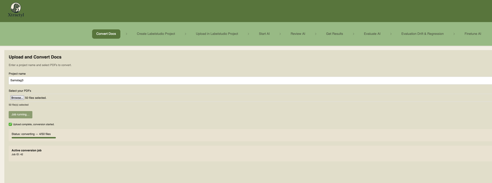


3. **Create a new project** in Label Studio  

   Page: **Create Project** (`/project`)  
   - Save your Label Studio token:
      click on "Get your legacy token" and create a user account for label studio
      in label studio go to http://localhost:8080/organization and enable the legacy token via the API Tokens setting go on http://localhost:8080/user/account then and copy the legacy token to your xtractyl tab and click "Save Token"
   - Enter project name, questions (one per line), and labels for each question (one per line
      and in the same order as the questions)
   - Create the project via the "Create project" button
   - To see questions and labels from projects saved as ground truth (see below) click "Show ground truth questions and labels"

### Create Project Page
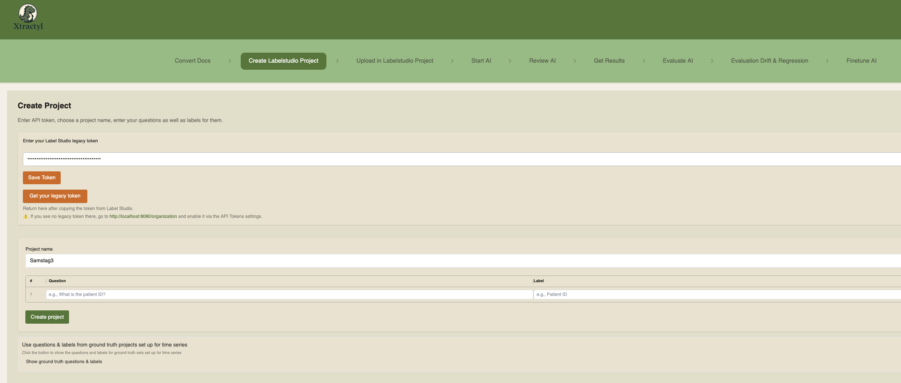

4. **Upload your tasks into the project**  

   Page: **Upload Tasks** (`/tasks`)  
   - Pick the project name  (same name as in step 3)
   - Click "Upload HTML Tasks"


### Upload Tasks Page
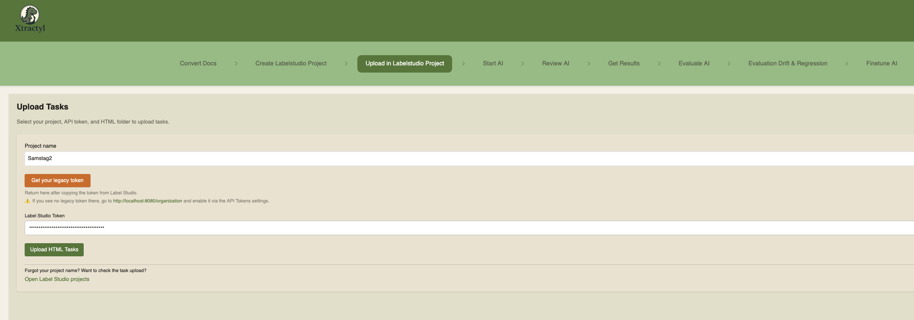


5. **Start AI prelabeling**  

   Page: **Start AI** (`/prelabelling`)  
   - Download an LLM (using the official model names from the linked ollama page)
   - After downloading a new model reload the page to make it available
   - Pick the project name  (same name as in step 3)
   - Enter the label studio token
   - Select a model from the dropdown list
   - Enter a system prompt to advise the model for literal extraction (you see a suggestions
      under "Show example")
     > **Caution:** The instruction `- If there is NO matching passage: respond with <<<NO_MATCH>>>.` must be included in the system prompt, otherwise true negatives are not marked correctly and evaluation metrics will be skewed.
   - Click the "Start prelabeling button"

### Start AI Page
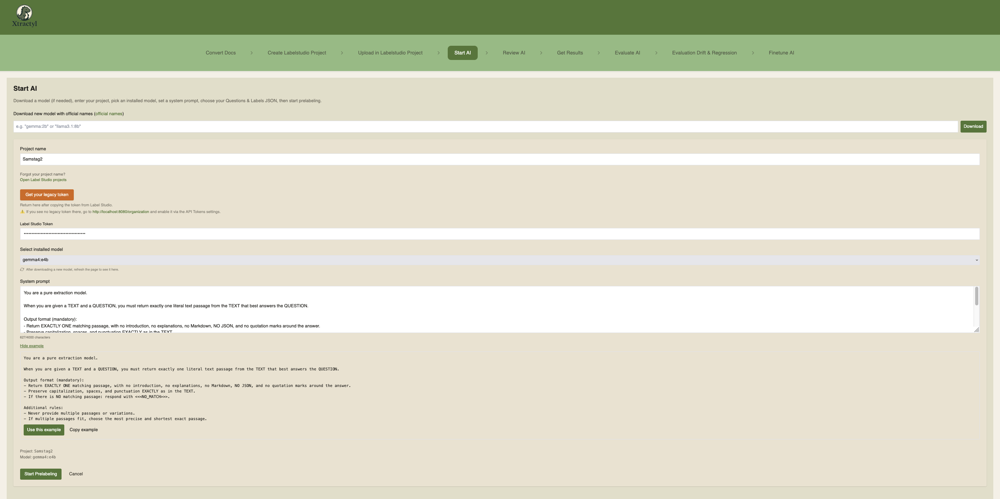


6. **Review the AI** 

   Page: **Review AI** (`/review`)  
   - Click the "Open Label Studio" to go to a to an overview of your label studio projects
   - Click on your project and
   - Validate/correct predictions for your files (in case you did not wait till prelabelling was finished, you have to reload to see the predictions added over time) and submit the changes


### Review AI 
> THE FOLLOWING IMAGE SHOWS SYNTHETIC DATA ONLY AND IS AN EXAMPLE FOR RESEARCH USE 
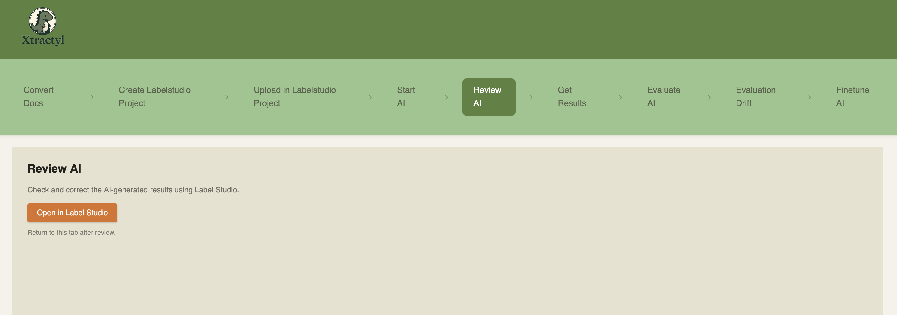

> THE FOLLOWING IMAGE SHOWS SYNTHETIC DATA ONLY AND IS AN EXAMPLE FOR RESEARCH USE 
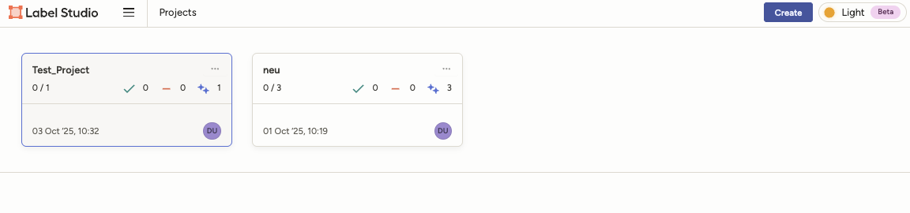

> THE FOLLOWING IMAGE SHOWS SYNTHETIC DATA ONLY AND IS AN EXAMPLE FOR RESEARCH USE 
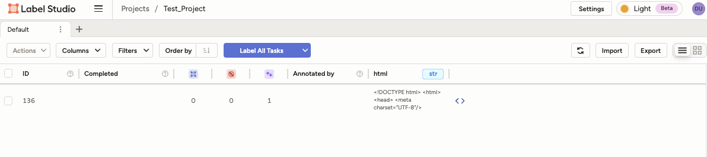

> THE FOLLOWING IMAGE SHOWS SYNTHETIC DATA ONLY AND IS AN EXAMPLE FOR RESEARCH USE 
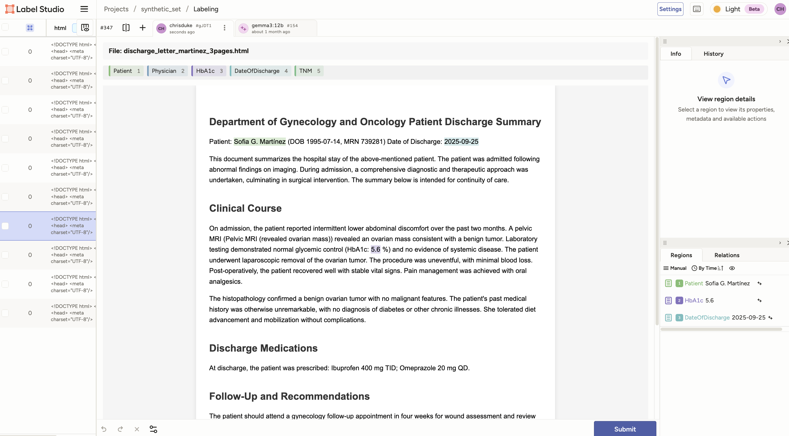


7. **Results Page** 

   Page: **Get Results** (`/results`)  
   - Enter your project name 
   - Enter the label studio token
   - Click "Submit" to get the results as a table (in case you did not wait till prelabelling was finished, you have to re-click to see the predictions added over time)


### Get Results 
> THE FOLLOWING IMAGE SHOWS SYNTHETIC DATA ONLY AND IS AN EXAMPLE FOR RESEARCH USE 
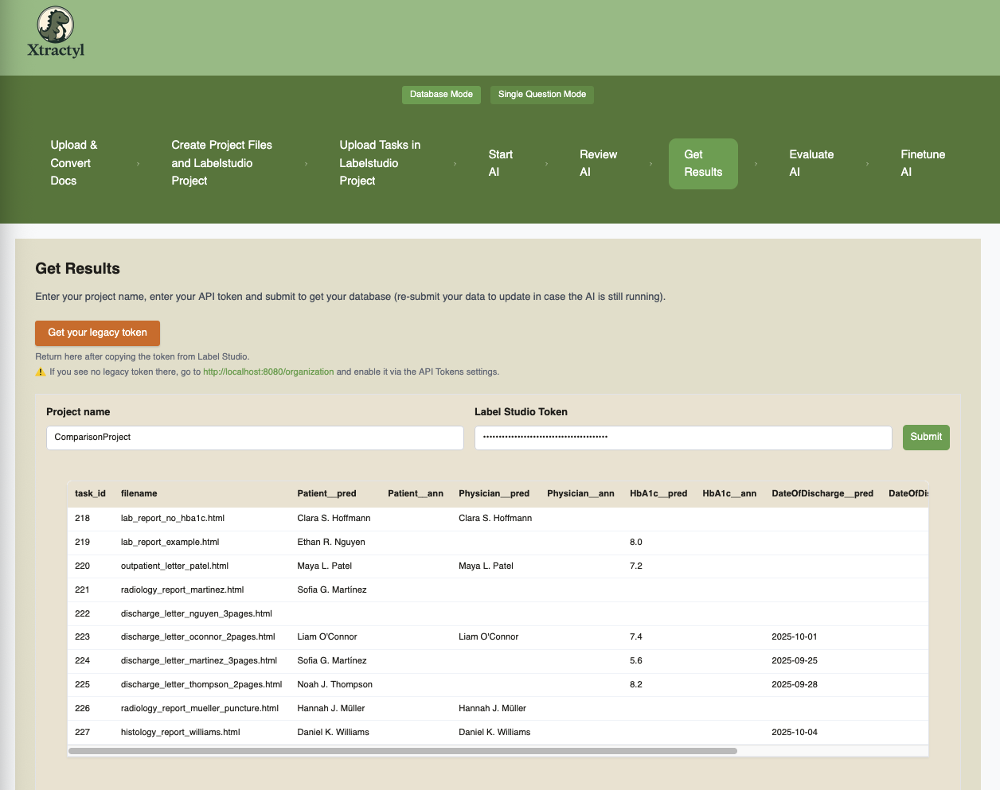


8. **Evaluate the AI** (`/evaluate`)  
   - Enter the label studio token
   - Optional: Export a new set as ground truth, select the project and name the new ground truth project (the project to be made ground truth has to have submitted annotations in label studio)
   - Select a project with your ground truth information
   - Select a project to compare against the ground truth 
   - Click "Run Evaluation"
   - Get metrics (Precision, Recall, F1, Accuracy) on an overall basis and per question/label
   - Get a per task (per PDF document) overview with ground truth answer, predicted answer and raw LLM answer
   - Get performance metrics (time per task [per PDF document], LLM time per tasks, time per question, LLM time per question etc.)


### Evaluate the AI 
> THE FOLLOWING IMAGE SHOWS SYNTHETIC DATA ONLY AND IS AN EXAMPLE FOR RESEARCH USE 
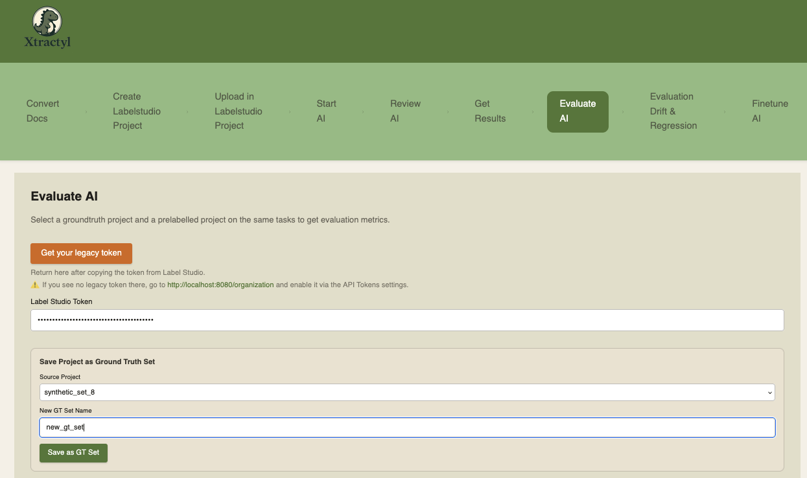

> THE FOLLOWING IMAGE SHOWS SYNTHETIC DATA ONLY AND IS AN EXAMPLE FOR RESEARCH USE 
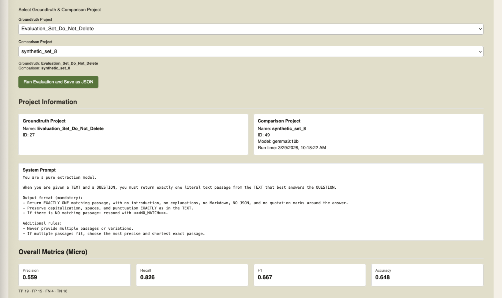

> THE FOLLOWING IMAGE SHOWS SYNTHETIC DATA ONLY AND IS AN EXAMPLE FOR RESEARCH USE 
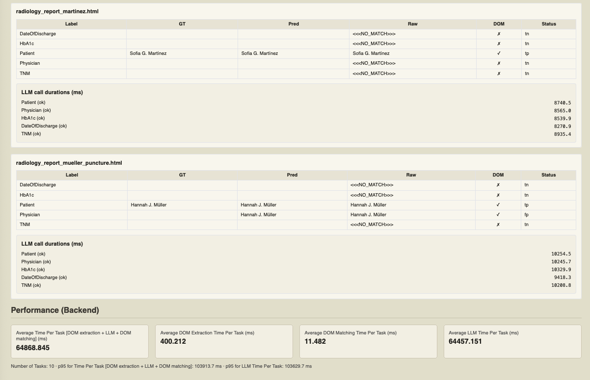

> THE FOLLOWING IMAGE SHOWS SYNTHETIC DATA ONLY AND IS AN EXAMPLE FOR RESEARCH USE 


9. **Monitor Evaluation Drift/Regression over Time for a Standard Set** (`/evaluationdrift`)  
   - Show all ground truth sets or select a specific
   - View Recall and Precision over Time for all runs evaluated against the ground truth set
   - View Recall and Precision over Time per Label for all runs evaluated against the ground truth set
   - Get the raw data as a table and match it to the data points in the plots (equal numbering)
   - View Recall and Precision for Regression Monitoring for sets with same System Prompt, same Questions and same Labels

### Evaluation Drift 
> THE FOLLOWING IMAGE SHOWS SYNTHETIC DATA ONLY AND IS AN EXAMPLE FOR RESEARCH USE 
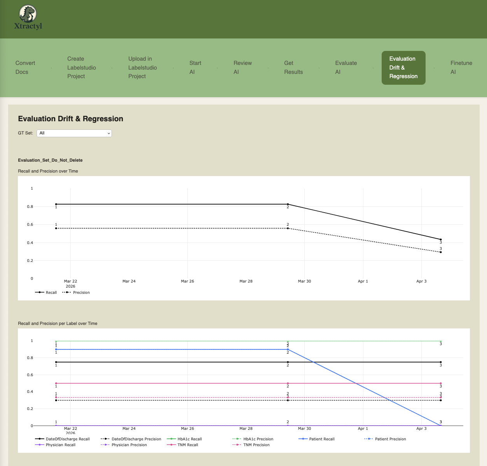

> THE FOLLOWING IMAGE SHOWS SYNTHETIC DATA ONLY AND IS AN EXAMPLE FOR RESEARCH USE 
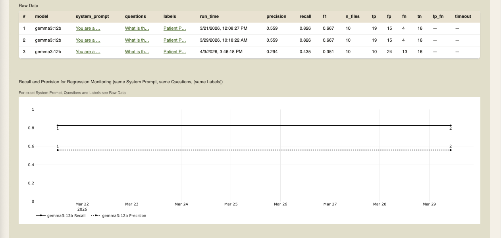


### Coming Soon

10. **FHIR integration**
   - see above for further explanation
11. **Host a validated model** (`/hosting`) 
   - Promote a validated configuration from Evaluate AI to a locked, versioned extraction endpoint


---

## 🧹 Code quality (integrated into CI)


### Installation

1. Install NVM and Python on your system

e.g. curl -o- https://raw.githubusercontent.com/nvm-sh/nvm/v0.40.1/install.sh | bash


2. Install Ruff for Python linting (local installation in system root outside docker)
```bash
python3 -m venv .venv
source .venv/bin/activate
pip install ruff
```

3. Install Node for JS linting (reads frontend/.nvmrc for the correct version)
```bash
cd frontend
nvm install
nvm use
```

### Usage

### python from repository root
```bash
source .venv/bin/activate
ruff format .
ruff check .
ruff check . --fix
```
### js for frontend from frontend folder
```bash
cd frontend
nvm use
npx eslint .
```


### Tests (see also "3. Testing" above for tests integrated into CI)

## Smoke tests
```bash
make deps
make up
make smoke
make down
```

## Unit tests 
```bash
make deps
make unit-orchestrator
make unit-worker
```
---

## Database migrations (Alembic)


To create a new migration (when you do not want to install alembic outside the container):

1. make the changes in `orchestrator/db/models.py`

2. ```docker compose up --build orchestrator``` (to write the new models.py into the container)

3. ```docker exec -it orchestrator alembic revision --autogenerate -m "Describe changes made"``` (to create a new version in alembic/versions/)

4. ```docker compose up --build orchestrator``` (to copy new version into container and adopt the changes in DB; migrations run automatically on container rebuild via `alembic upgrade head`)

 ---

 ## Data Lifecycle Reference

For a detailed breakdown of what gets written to Postgres and MinIO at each 
step of each pipeline (conversion, prelabelling, evaluation, ...), see 
[`docs/data-lifecycle.md`](docs/data-lifecycle.md). Useful for debugging 
stuck jobs or verifying data provenance.

---


## Versioning (SemVer)

This project uses Semantic Versioning (SemVer) with the format:

MAJOR.MINOR.PATCH

The version is stored in the root file `VERSION`.

Rules:

- PATCH: Bug fixes or internal changes that do not affect external behavior.
  Example: logging fixes, internal refactoring, test fixes.

- MINOR: Backward-compatible functional changes.
  Example: new features, new endpoints, extended functionality.

- MAJOR: breaking changes only after 1.0.0 (stable API).

  Example: API contract changes, data format changes, removal of functionality.

Note: While the major version is 0 (0.y.z), breaking changes may occur and are communicated via MINOR version bumps.

Version bump policy:

- Any change outside of `README.md` or `assets/` requires a version bump.
- The version bump must be included in the same Pull Request as the change.
- Git tags and GitHub releases are created automatically from the VERSION file.

Example:

VERSION
0.6.0 → 0.7.0

---

## Logging

1) Default mode (safe logs)
	•	enabled by default
	•	logs exclude sensitive data
	•	logs are written to:
	•	stdout / stream
	•	logs/ directory

2) Dev mode (debug artifacts)
	•	enabled only when explicitly requested
	•	logs may include sensitive data
	•	debug logs are written only to:
	•	data/logs/... (alongside evaluation / result artifacts)
	•	debug logs are never written to stdout or logs/

```bash 
DEBUG_ARTIFACTS=1 docker compose up
```

---

## Additional Documentation
For more details on how to use Label Studio (e.g. reviewing annotations, submitting, filtering), visit:
https://labelstud.io/guide

---

## License

Xtractyl is licensed under the **Xtractyl Non-Commercial License v1.1**.  
You are free to use, copy, modify, and distribute this software **only for non-commercial purposes**.  
Any commercial use requires a separate commercial license from the copyright holders.

**No Commercial Use Allowed Without Permission**  
See the [LICENSE](LICENSE) file for full terms.

---

## Disclaimer / Licensing & Attribution


This project is a private, non-commercial initiative developed independently during personal time.  
It has no connection to any employer or professional affiliation and is provided as-is for research and experimentation.

This project is released under the **Xtractyl Non-Commercial License v1.1**.  
It incorporates the following open-source components:

- [Label Studio](https://github.com/heartexlabs/label-studio) — Apache-2.0 License  
- [Docling](https://github.com/docling/docling) — MIT License  
- [Ollama](https://github.com/ollama/ollama) — MIT License  
- Local LLMs such as Gemma, which are subject to their own license terms from the respective model providers (e.g., Google)

Please refer to the [LICENSE](LICENSE) file for the full license text.
