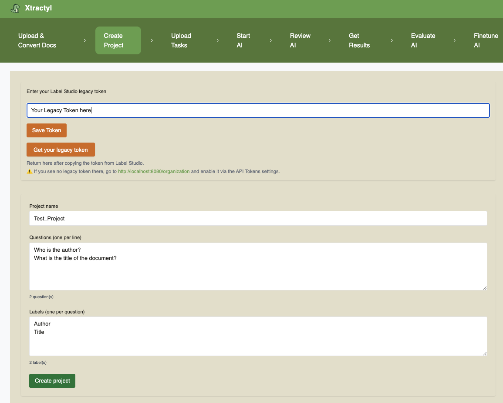
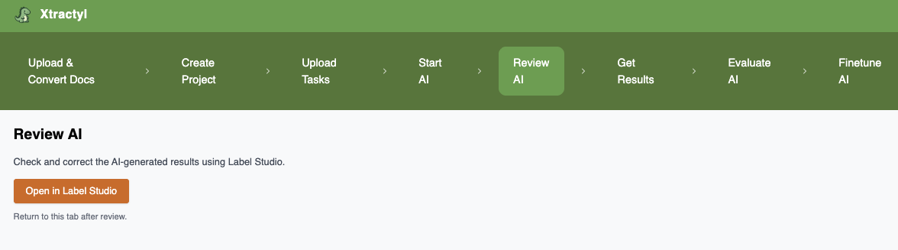
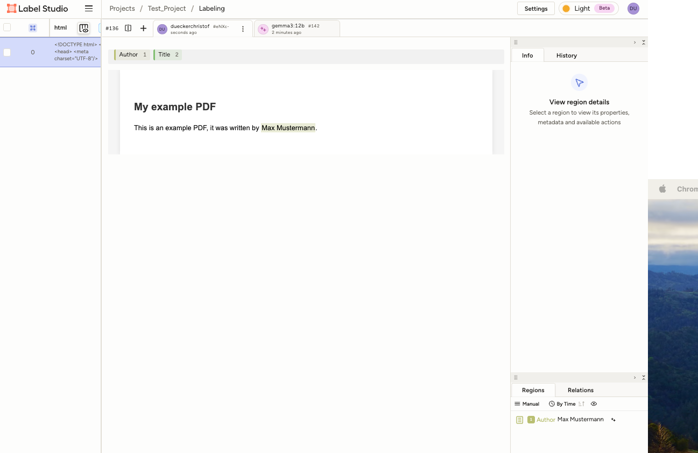

## Why this matters
Xtractyl runs fully locally and does not rely on external APIs or cloud services.

Extracting structured data from unstructured documents is a major challenge in regulated, data-intensive industries such as healthcare, life sciences, and public administration.
Xtractyl is used to identify patterns and extract structured data to generate aggregated, group-level insights — helping researchers and developers build auditable, privacy-preserving data pipelines.

Xtractyl demonstrates how to design a privacy-first, human-in-the-loop AI pipeline that is modular, auditable, and extensible.
It aims to create structured databases from the content of unstructured PDFs, combining local AI processing with human validation and modern containerized architectures.

While not a medical device, Xtractyl addresses key challenges relevant to MedTech and other compliance-driven fields:
	•	🔒 Local, privacy-preserving data processing
	•	🤖 AI-assisted annotation with human validation
	•	🧩 Extensible pipeline architecture using Docker and modern ML tools

⚠️ Note: Xtractyl is a research-only tool — not intended for commercial or medical use.

⚠️ Note: All included medical test data are fully synthetic and created with AI.

⚠️ Note: For development purposes data currently shows up in the local log files (be aware of that when working with real data)

## Work in Progress

⚠️ Note: Xtractyl is supposed to run on a server with GPU. GPU support is currently switched off (CUDA and MPS). CUDA support will be switched on as soon as we have the hardware to test it.

- The pipeline has so far been tested only with simple synthetic PDFs.

- The backend still requires optimization for accuracy and speed especially with complex PDFs.

- Testing is currently added.

- The results page and its backend endpoints are still missing. The results page has to include functionality to transform model answers to categorical data and standardize answers to turn them into database-ready.

- Pages and backend logic to evaluate AI metrics and finetune models are still missing.


## Project Management & Collaboration
This project is managed using industry-standard tools:

- [Jira Board (private, invitation only)](https://dueckerchristof.atlassian.net/jira/software/projects/SCRUM/boards/1/backlog)  
- [Miro Board (private, invitation only – link available on request)]


# 🦕 Xtractyl – Extract structured data from messy medical PDFs

**Xtractyl** is a modular, local, human-in-the-loop AI pipeline that searches unstructured PDF documents for specific cases in your data and builds a structured database from them.  

It converts PDFs → HTML → DOM → pre-labels them with an LLM → allows manual review via Label Studio → and 🦕 **xtracts** them into your database.

🔍 Designed for **privacy-first**, human-validated data extraction with evaluation & comparison tools built in.

---


## 📜 License

Xtractyl is licensed under the **Xtractyl Non-Commercial License v1.1**.  
You are free to use, copy, modify, and distribute this software **only for non-commercial purposes**.  
Any commercial use requires a separate commercial license from the copyright holders.

🔒 **No Commercial Use Allowed Without Permission**  
See the [LICENSE](LICENSE) file for full terms.

---


## 🚀 Features

- 🔒 Keeps all your data local — no cloud processing 
- ✅ Convert PDFs into structured HTML via **Docling**  
- 🤖 Pre-label data with an LLM (**Ollama: Gemma3 12B** by default)  
- 🧠 DOM-based XPath mapping and label matching  
- 👩‍⚕️ Human validation with **Label Studio**  
- 🔍 Find specific cases in your documents  
- 🦕 Extract a database from your previously unstructured data  
- 🐳 Modular **Docker** architecture  

---

## 📅 Planned Features

- 🦕 Create dashboards from your Xtractyl-generated database  
- 🧪 Evaluate predictions vs. ground truth with built-in metrics  
- 🎛️ Fine-tune models based on your labeled data 

---


## ⚙️ Setup

### 1. Requirements
Before installing Xtractyl, ensure you have the following installed on your system

- **GIT** 
- **Docker** 

---

### 2. Installation
Clone the repository:
git clone https://github.com/Xtractyl/xtractyl.git

Create a file named .env in the xtractyl folder (the .env.example file in /xtractyl is a template)

Create a file named .env in root/frontend/src (the .env.example file in xtractyl/frontend/src is a template)

for testing you can simply rename the .env.example files to .env (this will use default passwords and ports)

 then start the Docker containers from the xtractyl folder with:
docker compose up --build

access the frontend via your browser at http://localhost:5173/ following the workflow shown below under Usage

---

### 3. Current testing 

In development. Further information will be added soon.
For current testing:

- get you label studio legacy token from label studio starting xtractyl with: docker compose up --build and copy it from http://localhost:8080/user/account/legacy-token,  download the model you want to use for the test via the download option here: http://localhost:5173/prelabelling
- then: docker compose down
- make the model available via export TEST_MODEL=gemma3:12b (or another model using the model names from here https://ollama.com/library, but the included baseline_predictions.json has been created with gemma3:12b, to create your own baseline_predictions.json, just delete tests/e2e/data/ground_truth_and_baseline_results/baseline_predictions.json and a baseline_predictions.json with your model will be created on the first e2e test)
- to modify the ground truth file just go to tests/e2e/data/ground_truth_and_baseline_results/ground_truth.json
- make the label studio legacy token available with: export LABEL_STUDIO_LEGACY_TOKEN=your legacy token
- then run the tests via 
- make test-smoke   # just smoke test
- make test-e2e     # just e2e test


## 📖 Usage

1. **Open the frontend**  
	Go to: [http://localhost:5173]

2. **Upload your docs** (PDF → HTML conversion)  
   Page: **Upload & Convert** (`/`)  
   - type a folder name  for your project
   - Select PDFs and click **Upload & Convert**  
   - You can monitor status and cancel a running job

### Upload Page


3. **Create a new project** in Label Studio  
   Page: **Create Project** (`/project`)  
   - Save your Label Studio token:
      click on "Get your legacy token" and create a user account for label studio
      in label studio go to http://localhost:8080/organization and enable the legacy token via the API Tokens setting go on http://localhost:8080/user/account then and copy the legacy token to your xtractyl tab and click "Save Token"
   - Enter project name, questions (one per line), and labels for each question (one per line
      and in the same order as the questions)
   - Create the project via the "Create project" button

### Create Project Page



4. **Upload your tasks into the project**  
   Page: **Upload Tasks** (`/tasks`)  
   - Pick the project name  (same name as in step 3)
   - Select the HTML folder (from step 2)  
   - Click "Upload HTML Tasks"

### Upload Tasks Page


5. **Start AI prelabeling**  
   Page: **Start Prelabeling** (`/prelabelling`)  
   - Download an LLM (using the official model names from the linked ollama page)
   - After downloading a new model reload the page to make it available
   - Pick the project name  (same name as in step 3)
   - Select a model from the dropdown list
   - Enter a system prompt to advise the model for literal extraction (you see a suggestions
      under "Show example")
   - Select the json file with your questions and labels from the dropdown list (click the
      the Preview button for review)
   - Click the "Start prelabeling button"

### Start AI Page


6. **Review the AI**  
   Page: **Review in Label Studio** (`/review`)  
   - Click the "Open Label Studio" to go to a to an overview of your label studio projects,
      click on your project and validate/correct predictions for your files (in case you did not wait till prelabelling was finished, you have to reload to see the predictions added over time)

### Review AI 






---

### ⏭️ Coming Soon

7. **Get your results**  
   Page: **Get Results** (`/results`)  
   - Export validated annotations for downstream use

8. **Evaluate the AI** (`/evaluate`)  
   - Compare predictions vs. ground truth, see metrics

9. **Fine-tune the AI** (`/finetune`) 
   - Use your labeled data to improve model performance

---

## 🧹 Code quality

### python from repository root
```bash
ruff format .
ruff check .
```
### js for frontend from frontend folder
```bash
cd frontend
npx eslint .
```

---
## 📝 Additional Documentation
For more details on how to use Label Studio (e.g. reviewing annotations, submitting, filtering), visit:
👉 https://labelstud.io/guide

---

## 📝 Disclaimer / Licensing & Attribution


This project is a private, non-commercial initiative developed independently during personal time.  
It has no connection to any employer or professional affiliation and is provided as-is for research and experimentation.

This project is released under the **Xtractyl Non-Commercial License v1.1**.  
It incorporates the following open-source components:

- [Label Studio](https://github.com/heartexlabs/label-studio) — Apache-2.0 License  
- [Docling](https://github.com/docling/docling) — MIT License  
- [Ollama](https://github.com/ollama/ollama) — MIT License  
- Local LLMs such as Gemma, which are subject to their own license terms from the respective model providers (e.g., Google)

Please refer to the [LICENSE](LICENSE) file for the full license text.