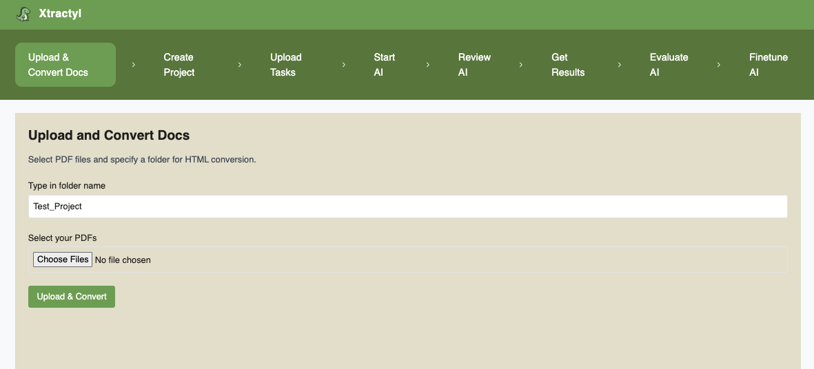
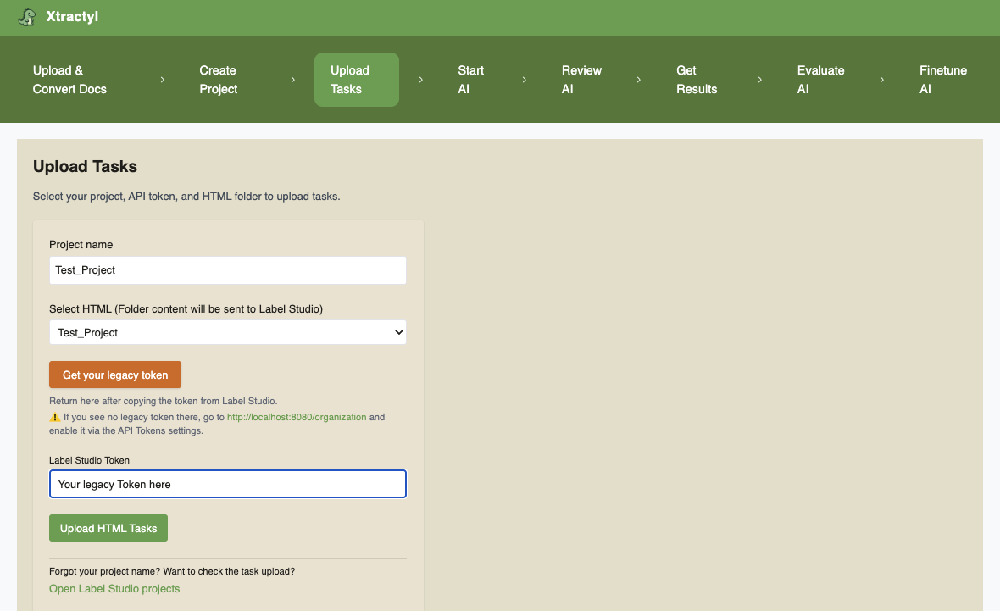

<p align="center">
  
</p>

# 🦕 Extract structured data from messy medical PDFs

**Xtractyl** is a modular, local, human-in-the-loop AI pipeline that searches unstructured PDF documents for specific cases and builds a structured database from them.

It converts PDFs → HTML → DOM → pre-labels them with an LLM → enables manual review via Label Studio → and 🦕 **xtracts** structured data for downstream analysis.

Xtractyl provides evaluation and performance metrics for the LLM used, allowing comparison of speed–accuracy trade-offs across different models, question formulations, and system prompts.  
Planned: local fine-tuning of models on domain-specific data to further improve performance.

🔍 Designed for **privacy-first**, human-validated data extraction with built-in evaluation and comparison tools.

---

## Why this matters
Xtractyl runs fully locally and does not rely on external APIs or cloud services.

Extracting structured data from unstructured documents is a major challenge in regulated, data-intensive industries such as healthcare, life sciences, and public administration.
Xtractyl is used to identify patterns and extract structured data to generate aggregated, group-level insights — helping researchers and developers build auditable, privacy-preserving data pipelines.

Xtractyl demonstrates how to design a privacy-first, human-in-the-loop AI pipeline that is modular, auditable, and extensible.
It aims to create structured databases from the content of unstructured PDFs, combining local AI processing with human validation and modern containerized architectures.

While not a medical device, Xtractyl addresses key challenges relevant to MedTech and other compliance-driven fields:
	•	🔒 Local, privacy-preserving data processing
	•	🤖 AI-assisted annotation with human validation
	•	🧩 Extensible pipeline architecture using Docker and modern ML tools

⚠️ Note: Xtractyl is a research-only tool — not intended for commercial or medical use.

⚠️ Note: All included medical test data are fully synthetic and created with AI.

⚠️ Note: For development purposes data currently shows up in the local log files (be aware of that when working with real data)

---

## 🏗️ Architecture Overview

Items with green background are already implemented end-to-end ✅, items with red background are under construction 🧱

```mermaid
flowchart TD

%% ====== TOP NODE ======
T[Frontend]

%% ====== ROW 1 ======
subgraph ZA[" "]
direction LR
 A1A[Frontend - Upload & Convert Docs] --> B1A[Docling]
end

T --> ZA

%% ====== ROW 2 ======
subgraph ZA2[" "]
direction LR
 A2A[Frontend - Create Project] --> B2A[Orchestrator] --> C2A[Label Studio]
end

ZA --> ZA2

%% ====== ROW 3 ======
subgraph ZA3[" "]
direction LR
 A3A[Frontend - Upload Tasks] --> B3A[Orchestrator] --> C3A[Label Studio]
end

ZA2 --> ZA3

%% ====== ROW 4 ======
subgraph ZA4[" "]
direction LR
 A4A[Frontend - Start AI]
 B4A[Orchestrator]
 C4A[Redis] 
 D4A[Worker] 
 E4A[ML backend] 
 F4A[Ollama]
 G4A[Label Studio]
end

A4A --> B4A
B4A --> C4A
C4A --> D4A
D4A --> E4A
E4A --> F4A
F4A --> E4A
E4A --> G4A

ZA3 --> ZA4

%% ====== ROW 5 ======
subgraph ZA5[" "]
direction LR
 A5A[Frontend - Review AI] --> B5A[Label Studio]
end

ZA4 --> ZA5

%% ====== ROW 6 ======
subgraph ZA6[" "]
direction LR
 A6[Frontend - Get Results] --> B6A[Orchestrator] --> C6A[Label Studio]
end

ZA5 --> ZA6

%% ====== ROW 7 ======
subgraph ZA7[" "]
direction LR
 A7[Frontend - Evaluate AI] --> B7A[Orchestrator] --> C7A[Label Studio] 
end

ZA6 --> ZA7

%% ====== ROW 8 ======
subgraph ZA8[" "]
direction LR
 A8[Frontend - Finetune AI] 
end

ZA7 --> ZA8

%% ====== STYLING ======
style ZA fill:#A7F3D0,stroke:#88a,stroke-width:1px;
style ZA2 fill:#A7F3D0,stroke:#88a,stroke-width:1px;
style ZA3 fill:#A7F3D0,stroke:#88a,stroke-width:1px;
style ZA4 fill:#A7F3D0,stroke:#88a,stroke-width:1px;
style ZA5 fill:#A7F3D0,stroke:#88a,stroke-width:1px;
style ZA6 fill:#A7F3D0,stroke:#88a,stroke-width:1px;
style ZA7 fill:#A7F3D0,stroke:#88a,stroke-width:1px;
style ZA8 fill:#FCA5A5,stroke:#88a,stroke-width:1px;
  ```

  ---

## Work in Progress

⚠️ Note: Xtractyl is supposed to run on a server with GPU. GPU support is currently switched off (CUDA and MPS). CUDA support will be switched on as soon as we have the hardware to test it.

- The pipeline has so far been tested only with simple synthetic PDFs.

- The backend still requires optimization for accuracy and speed especially with complex PDFs. This optimization is now possible, because evaluation and performance metrics have been integrated

- Testing is currently being added.

- Pages and backend logic to finetune models are still missing.

---


## 🚀 Features

- 🔒 Keeps all your data local — no cloud processing
- 📄 Convert PDFs into structured HTML via Docling
- 🤖 AI-assisted pre-labeling with local LLMs (Ollama: Gemma3 12B by default)
- 🧠 DOM-based XPath mapping and label matching
- 👩‍⚕️ Human validation with Label Studio
- 🔍 Identify specific cases across large document collections
- 🦕 Extract structured databases from previously unstructured data
- 📊 Built-in evaluation of AI predictions (precision, recall, F1, accuracy)
- ⏱️ Performance metrics (end-to-end runtime, per-document and per-question latency)
- ⚖️ Speed–accuracy comparison across models, prompts, and question formulations
- 🐳 Modular, containerized Docker architecture

---

## 📅 Planned Features

- 🦕 Create dashboards from your Xtractyl-generated database  
- 🧪 Evaluate predictions vs. ground truth with built-in metrics  
- 🎛️ Fine-tune models based on your labeled data 

---

## Project Management & Collaboration
This project is managed using industry-standard tools:

- [Jira Board (private, invitation only – link available on request)]
- [Miro Board (private, invitation only – link available on request)]

---

## ⚙️ Setup

### 1. Requirements
Before installing Xtractyl, ensure you have the following installed on your system

- **GIT** 
- **Docker** 

### 2. Installation
Clone the repository:
git clone https://github.com/Xtractyl/xtractyl.git

Create a file named .env in the xtractyl folder (the .env.example file in /xtractyl is a template)

Create a file named .env in root/frontend/src (the .env.example file in xtractyl/frontend/src is a template)

For testing you can simply rename the .env.example files to .env (this will use default passwords and ports)

⚠️ **Warning:** The build currently downloads *all* Docling models (several GB) to ensure full offline functionality. This can be changed to the specific use case via modification of the file docker/docling/Dockerfile at the line: RUN docling-tools models download --all -o /opt/docling-models.

 Then start the Docker containers from the xtractyl folder with:
docker compose up --build

Access the frontend via your browser at http://localhost:5173/ following the workflow shown below under Usage

---

### 3. Testing

#### Smoke tests (pytest)

Currently in implementation.

Included so far:
orchestrator

* Be aware that the compose up excludes docling to avoid model pull

```bash
make deps
make up
make smoke
make down
```

#### Unit tests (pytest)
Currently in implementation.

Included so far:
test_results_table_minimal

```bash
docker compose run --rm orchestrator python -m pytest -q tests/unit
```

#### Integration tests (pytest)
Currently in implementation.

#### E2E tests
Planned next.

---


## 📖 Usage

1. **Open the frontend**  
	Go to: [http://localhost:5173]

2. **Upload your docs** (PDF → HTML conversion)  

   Page: **Upload & Convert Docs** (`/`)  
   - type a folder name  for your project
   - Select PDFs and click **Upload & Convert**  
   - You can monitor status and cancel a running job

---
### Upload Page



---

3. **Create a new project** in Label Studio  

   Page: **Create Project** (`/project`)  
   - Save your Label Studio token:
      click on "Get your legacy token" and create a user account for label studio
      in label studio go to http://localhost:8080/organization and enable the legacy token via the API Tokens setting go on http://localhost:8080/user/account then and copy the legacy token to your xtractyl tab and click "Save Token"
   - Enter project name, questions (one per line), and labels for each question (one per line
      and in the same order as the questions)
   - Create the project via the "Create project" button

---
### Create Project Page


---

4. **Upload your tasks into the project**  

   Page: **Upload Tasks** (`/tasks`)  
   - Pick the project name  (same name as in step 3)
   - Select the HTML folder (from step 2)  
   - Click "Upload HTML Tasks"

---

### Upload Tasks Page


---

5. **Start AI prelabeling**  

   Page: **Start AI** (`/prelabelling`)  
   - Download an LLM (using the official model names from the linked ollama page)
   - After downloading a new model reload the page to make it available
   - Pick the project name  (same name as in step 3)
   - Enter the label studio token
   - Select a model from the dropdown list
   - Enter a system prompt to advise the model for literal extraction (you see a suggestions
      under "Show example")
   - Select the json file with your questions and labels from the dropdown list (click the
      the Preview button for review)
   - Click the "Start prelabeling button"

---
### Start AI Page


---

6. **Review the AI** 

   Page: **Review AI** (`/review`)  
   - Click the "Open Label Studio" to go to a to an overview of your label studio projects
   - Click on your project and
   - Validate/correct predictions for your files (in case you did not wait till prelabelling was finished, you have to reload to see the predictions added over time) and submit the changes

---

### Review AI 


---

7. **Results Page** 

   Page: **Get Results** (`/results`)  
   - Enter your project name 
   - Enter the label studio token
   - Click "Submit & Save as CSV" to get the results (in case you did not wait till prelabelling was finished, you have to re-click to see the predictions added over time)

---
### Get Results 
❗❗THE FOLLOWING IMAGE SHOWS SYNTHETIC DATA ONLY AND IS AN EXAMPLE FOR RESEARCH USE❗❗


❗❗THE ABOVE IMAGE SHOWS SYNTHETIC DATA ONLY AND IS AN EXAMPLE FOR RESEARCH USE❗❗

---

8. **Evaluate the AI** (`/evaluate`)  
   - Enter the label studio token
   - Select a project with your groundtruth information
   - Select a project to compare against the groundtruth 
   - Click "Run Evaluation and Save as JSON"
   - Get metrics (Precision, Recall, F1, Accuracy) on an overall basis and per question/label
   - Get a per task (per PDF document) overview with groundtruth answer, predicted answer and raw LLM answer
   - Get performance metrics (time per task [per PDF document], LLM time per tasks, time per question, LLM time per question etc.)

---
### Evaluate the AI 
❗❗THE FOLLOWING IMAGE SHOWS SYNTHETIC DATA ONLY AND IS AN EXAMPLE FOR RESEARCH USE❗❗


❗❗THE FOLLOWING IMAGE SHOWS SYNTHETIC DATA ONLY AND IS AN EXAMPLE FOR RESEARCH USE❗❗


❗❗THE FOLLOWING IMAGE SHOWS SYNTHETIC DATA ONLY AND IS AN EXAMPLE FOR RESEARCH USE❗❗


❗❗THE ABOVE IMAGES SHOW SYNTHETIC DATA ONLY AND IS AN EXAMPLE FOR RESEARCH USE❗❗

--- 

### ⏭️ Coming Soon

9.**Fine-tune the AI** (`/finetune`) 
   - Use your labeled data to improve model performance

---

## 🧹 Code quality (integrated into CI)

### python from repository root
```bash
ruff format .
ruff check .
ruff check . --fix
```
### js for frontend from frontend folder
```bash
cd frontend
npx eslint .
```
### Tests (see also "3. Testing" above for tests integrated into CI)

## Smoke tests
```bash
make deps
make up
make smoke
make down
```

## Unit tests 
```bash
docker compose run --rm orchestrator python -m pytest -q tests/unit
```

---

## 📝 Additional Documentation
For more details on how to use Label Studio (e.g. reviewing annotations, submitting, filtering), visit:
👉 https://labelstud.io/guide

---

## 📜 License

Xtractyl is licensed under the **Xtractyl Non-Commercial License v1.1**.  
You are free to use, copy, modify, and distribute this software **only for non-commercial purposes**.  
Any commercial use requires a separate commercial license from the copyright holders.

🔒 **No Commercial Use Allowed Without Permission**  
See the [LICENSE](LICENSE) file for full terms.

---

## 📝 Disclaimer / Licensing & Attribution


This project is a private, non-commercial initiative developed independently during personal time.  
It has no connection to any employer or professional affiliation and is provided as-is for research and experimentation.

This project is released under the **Xtractyl Non-Commercial License v1.1**.  
It incorporates the following open-source components:

- [Label Studio](https://github.com/heartexlabs/label-studio) — Apache-2.0 License  
- [Docling](https://github.com/docling/docling) — MIT License  
- [Ollama](https://github.com/ollama/ollama) — MIT License  
- Local LLMs such as Gemma, which are subject to their own license terms from the respective model providers (e.g., Google)

Please refer to the [LICENSE](LICENSE) file for the full license text.